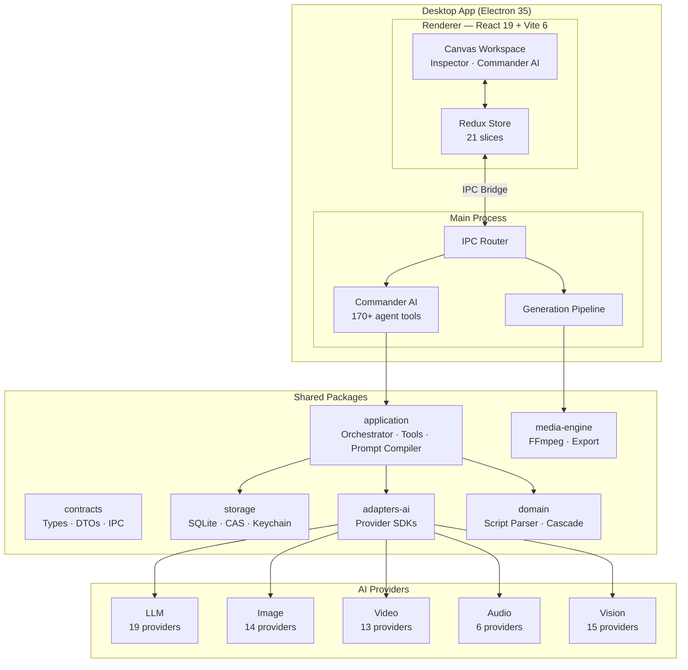

<div align="center">

<!-- HERO BANNER -->


<br>

# Lucid Fin

### AI-Powered Film Production Desktop App

*Turn scripts into shots, shots into scenes, scenes into films — all driven by AI.*

<p>
  <a href="#-features">Features</a> &nbsp;&bull;&nbsp;
  <a href="#-screenshots">Screenshots</a> &nbsp;&bull;&nbsp;
  <a href="#-architecture">Architecture</a> &nbsp;&bull;&nbsp;
  <a href="#-quick-start">Quick Start</a> &nbsp;&bull;&nbsp;
  <a href="README.zh-CN.md">中文</a>
</p>

<p>
  
  
  
  
  
</p>

<p>
  
  
  
  
  
  
  
</p>

</div>

---

## Features

<table>
  <tr>
    <td width="33%" valign="top">
      <h4>Canvas Workspace</h4>
      <p>Node-based visual editor — image, video, audio, text, and backdrop nodes connected by directional edges. Drag, connect, generate.</p>
    </td>
    <td width="33%" valign="top">
      <h4>Commander AI</h4>
      <p>Built-in AI assistant with 170+ tools. Break down scripts, manage characters, apply presets, analyze images, generate media — all from chat.</p>
    </td>
    <td width="33%" valign="top">
      <h4>Preset System</h4>
      <p>8-category preset tracks (subject, style, camera, lighting, color, mood, composition, effects) with per-entry intensity and multi-param controls.</p>
    </td>
  </tr>
  <tr>
    <td width="33%" valign="top">
      <h4>Video Clone Mode</h4>
      <p>Import a video &rarr; auto-detect scene cuts &rarr; extract keyframes &rarr; describe each with vision AI &rarr; rebuild as an AI-ready canvas.</p>
    </td>
    <td width="33%" valign="top">
      <h4>Vision Analysis</h4>
      <p>Reverse prompt inference from any image. Extract art style, lighting, color palette, mood, composition — 15+ vision providers supported.</p>
    </td>
    <td width="33%" valign="top">
      <h4>Emotion Vector TTS</h4>
      <p>8-dimensional emotion control (happy, sad, angry, fearful, surprised, disgusted, contemptuous, neutral) for expressive voice synthesis.</p>
    </td>
  </tr>
  <tr>
    <td width="33%" valign="top">
      <h4>Script Integration</h4>
      <p>Import Fountain/FDX/plaintext screenplays. Auto-breakdown into shots. Convert to canvas nodes with characters, locations, equipment linked.</p>
    </td>
    <td width="33%" valign="top">
      <h4>Cross-Frame Continuity</h4>
      <p>Auto-extract the last frame of a completed video and set it as the first frame of the next node — seamless visual transitions.</p>
    </td>
    <td width="33%" valign="top">
      <h4>Pro Export</h4>
      <p>Export to CapCut, FCPXML, EDL. Compatible with Final Cut Pro, DaVinci Resolve, Premiere Pro.</p>
    </td>
  </tr>
</table>

<details>
<summary><strong>More features...</strong></summary>

- **Dual Prompt System** — Separate image and video prompts per node
- **Character & Equipment Manager** — Reference images, structured appearance fields for consistency
- **Lip Sync** — Post-generation lip-sync via cloud API or local Wav2Lip
- **Adaptive Tool Execution** — Concurrency auto-tunes based on success rate (1-8 parallel calls)
- **Context Compaction** — Codex/Claude Code inspired handoff-style summarization with anti-thrash protection
- **Shot Templates** — Apply pre-defined shot setups across multiple nodes at once
- **Batch Tool Operations** — Most canvas tools support multi-node batch execution
- **i18n** — Full English and Chinese localization

</details>

---

## Screenshots

> Screenshots needed — see [Contributing](#-contributing)

<details open>
<summary><strong>Canvas Workspace</strong></summary>
<br>

<em>Node-based canvas with image/video/audio nodes, preset tracks, and generation controls</em>
</details>

<details>
<summary><strong>Commander AI</strong></summary>
<br>

<em>AI assistant with slash commands, tool calls, streaming responses, and context management</em>
</details>

<details>
<summary><strong>Preset System</strong></summary>
<br>

<em>8-category preset tracks with intensity sliders and per-entry parameter controls</em>
</details>

<details>
<summary><strong>Settings & Providers</strong></summary>
<br>

<em>Multi-provider configuration for LLM, Image, Video, Audio, and Vision AI</em>
</details>

---

## Supported AI Providers

<table>
  <tr>
    <th>Category</th>
    <th>Providers</th>
  </tr>
  <tr>
    <td><strong>LLM</strong></td>
    <td>
      
      
      
      
      
      
      
      
      <br>
      
      
      
      
      
      
      
      
      
    </td>
  </tr>
  <tr>
    <td><strong>Image</strong></td>
    <td>OpenAI GPT Image, Google Imagen 4, Recraft, Ideogram, Replicate, fal, Stability, Together AI, SiliconFlow, Zhipu CogView, Tongyi Wanxiang, Kolors (Kuaishou), StepFun, Volcengine Seedream</td>
  </tr>
  <tr>
    <td><strong>Video</strong></td>
    <td>Google Veo 2, Runway Gen-4, Luma Dream Machine, Pika, Kling, MiniMax Hailuo, Vidu (Shengshu), Replicate, fal, SiliconFlow, Zhipu CogVideoX, Tongyi (Alibaba), Volcengine Doubao Video</td>
  </tr>
  <tr>
    <td><strong>Audio</strong></td>
    <td>ElevenLabs, MiniMax TTS, Volcengine TTS, Azure TTS, Google Cloud TTS, OpenAI TTS</td>
  </tr>
  <tr>
    <td><strong>Vision</strong></td>
    <td>15+ providers — same as LLM list (OpenAI, Gemini, Claude, Qwen, Grok, Mistral, DeepSeek, etc.)</td>
  </tr>
</table>

---

## Architecture



<details>
<summary><strong>Directory Structure</strong></summary>

```
apps/
  desktop-main/         Electron main process — IPC, generation pipeline, Commander AI
  desktop-renderer/     React + Vite frontend — canvas, panels, Redux store

packages/
  contracts/            Shared TypeScript types, DTOs, IPC channel definitions
  storage/              SQLite database, content-addressable asset store, OS keychain
  adapters-ai/          AI provider adapters (image, video, audio, LLM, vision)
  application/          Commander AI orchestrator, 170+ agent tools, prompt compiler
  domain/               Script parser, prompt assembler, cascade logic
  media-engine/         FFmpeg utilities, Ken Burns, stitcher, NLE export

.github/workflows/     CI pipeline — type check, test, lint on every push/PR
e2e/                    Playwright end-to-end tests
docs/                   AI prompt guides, planning docs
```

</details>

---

## Quick Start

```bash
# Clone
git clone https://github.com/NAinfini/Inifni-Lucid-Fin.git
cd Inifni-Lucid-Fin

# Install
npm install

# Dev
npm run dev

# Test
npm test

# Build
npm run build
```

<details>
<summary><strong>Prerequisites</strong></summary>

| Requirement | Version |
|-------------|---------|
| Node.js     | >= 20   |
| npm         | >= 10   |
| FFmpeg      | >= 6 (for video processing) |
| OS          | Windows / macOS / Linux |

</details>

<details>
<summary><strong>AI Provider Setup</strong></summary>

1. Open **Settings** (gear icon)
2. Select a provider tab: **LLM**, **Image**, **Video**, **Audio**, or **Vision**
3. Enter your API key and click **Save**
4. Set the provider as active
5. For custom providers, click **+ Add Custom**, enter name, base URL, and model

</details>

---

## CI / CD

Every push and pull request runs the full CI pipeline via GitHub Actions:

| Job | What it does |
|-----|-------------|
| **Type Check** | `tsc --noEmit` across `contracts`, `application`, `adapters-ai` |
| **Tests** | `vitest run` — all unit and integration tests |
| **Lint** | `eslint` with zero-warning policy |

See [`.github/workflows/ci.yml`](.github/workflows/ci.yml) for the full config.

---

## Star History

<div align="center">

[](https://star-history.com/#NAinfini/Inifni-Lucid-Fin&Date)

</div>

---

## License

Proprietary — All rights reserved.

---

<div align="center">

**Built with passion for AI filmmakers**

</div>
