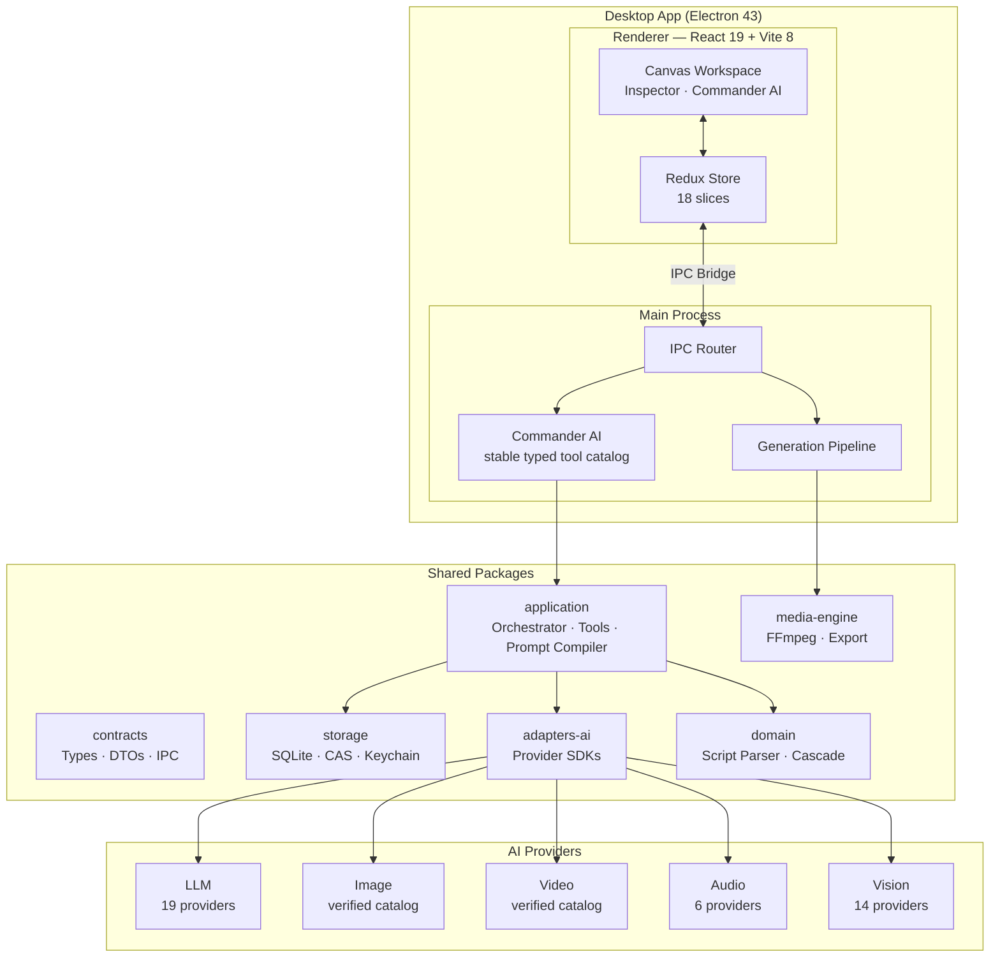

<div align="center">


<br>

# Lucid Fin

### AI-Powered Film Production Desktop App

_Turn scripts into shots, shots into scenes, scenes into films — all driven by AI._

<p>
  <a href="#-features">Features</a> &nbsp;&bull;&nbsp;
  <a href="#-screenshots">Screenshots</a> &nbsp;&bull;&nbsp;
  <a href="#-supported-ai-providers">Providers</a> &nbsp;&bull;&nbsp;
  <a href="#-architecture">Architecture</a> &nbsp;&bull;&nbsp;
  <a href="docs/TECH_STACK.md">Tech Stack</a> &nbsp;&bull;&nbsp;
  <a href="#-quick-start">Quick Start</a> &nbsp;&bull;&nbsp;
  <a href="README.zh-CN.md">中文</a>
</p>

<p>
  
  
  
  
  
</p>

<p>
  
  
  
  
  
  
  
</p>

</div>

---

## Features

<table>
  <tr>
    <td width="33%" valign="top">
      <h4>Canvas Workspace</h4>
      <p>Node-based visual editor — image, video, audio, text, and backdrop nodes connected by directional edges. Drag, connect, generate.</p>
    </td>
    <td width="33%" valign="top">
      <h4>Commander AI</h4>
      <p>Built-in AI assistant with a stable typed tool catalog. Break down scripts, manage characters, apply presets, analyze images, generate media, and delegate bounded work — all from chat.</p>
    </td>
    <td width="33%" valign="top">
      <h4>Preset System</h4>
      <p>8-category preset tracks (camera, composition, mood, pacing, lens, visual style, scene lighting, technical) with per-entry intensity and multi-param controls.</p>
    </td>
  </tr>
  <tr>
    <td width="33%" valign="top">
      <h4>Vision Analysis</h4>
      <p>Reverse prompt inference from any image. Extract art style, lighting, color palette, mood, composition — 15+ vision providers supported.</p>
    </td>
    <td width="33%" valign="top">
      <h4>Emotion Vector TTS</h4>
      <p>8-dimensional emotion control (happy, sad, angry, fearful, surprised, disgusted, contemptuous, neutral) for expressive voice synthesis.</p>
    </td>
  </tr>
  <tr>
    <td width="33%" valign="top">
      <h4>Script Integration</h4>
      <p>Import Fountain/FDX/plaintext screenplays. Auto-breakdown into shots. Convert to canvas nodes with characters, locations, equipment linked.</p>
    </td>
    <td width="33%" valign="top">
      <h4>Cross-Frame Continuity</h4>
      <p>Auto-extract the last frame of a completed video and set it as the first frame of the next node — seamless visual transitions.</p>
    </td>
    <td width="33%" valign="top">
      <h4>Pro Export</h4>
      <p>Review and approve an immutable Final Export manifest, then render a verified MP4 or MOV locally with FFmpeg.</p>
    </td>
  </tr>
</table>

<details>
<summary><strong>More features...</strong></summary>

- **Durable Prompt Assembly** — Commander reconciles user intent, presets, references, and Task List authority into one auditable provider prompt
- **Character & Equipment Manager** — Reference images, structured appearance fields for consistency
- **Location Manager** — Structured scene locations with mood, weather, lighting, reference images
- **Adaptive Tool Execution** — Concurrency auto-tunes based on success rate (1-8 parallel calls)
- **Context Compaction** — Codex/Claude Code inspired handoff-style summarization with anti-thrash protection
- **Shot Templates** — Apply pre-defined shot setups across multiple nodes at once
- **Batch Tool Operations** — Most canvas tools support multi-node batch execution
- **Snapshot & Rollback** — Time Machine-style tiered retention with manual and auto snapshots
- **i18n** — Full English and Chinese localization

</details>

---

## Screenshots

<table>
  <tr>
    <td width="50%">
      <strong>Commander AI</strong><br>
      <br>
      <em>AI assistant with stable tools, public run activity, tool confirmations, and slash commands</em>
    </td>
    <td width="50%">
      <strong>Preset Tracks</strong><br>
      <br>
      <em>8-category preset tracks with shot templates and per-entry intensity controls</em>
    </td>
  </tr>
  <tr>
    <td width="50%">
      <strong>Character Manager</strong><br>
      <br>
      <em>Structured character profiles with reference images, appearance, personality, and loadouts</em>
    </td>
    <td width="50%">
      <strong>Location Manager</strong><br>
      <br>
      <em>Scene locations with mood, weather, lighting, reference images, and node usage tracking</em>
    </td>
  </tr>
  <tr>
    <td width="50%">
      <strong>Settings — Commander AI</strong><br>
      <br>
      <em>Agent controls: token, tool-call, time and cost budgets, plus context and output safety limits</em>
    </td>
    <td width="50%">
      <strong>Settings — Providers</strong><br>
      <br>
      <em>Multi-provider configuration for LLM, Image, Video, Audio, and Vision AI</em>
    </td>
  </tr>
</table>

> **Still needed:** Canvas workspace overview, generation in progress, export dialog

---

## Supported AI Providers

<table>
  <tr>
    <th>Category</th>
    <th>Providers</th>
  </tr>
  <tr>
    <td><strong>LLM</strong></td>
    <td>
      
      
      
      
      
      
      
      
      <br>
      
      
      
      
      
      
      
      
      
    </td>
  </tr>
  <tr>
    <td><strong>Image</strong></td>
    <td>ChatGPT Image Generation (OAuth), OpenAI GPT Image 2, Google Gemini 3.1 Image, Recraft, Ideogram, Leonardo, Zhipu GLM Image, StepFun, Volcengine Seedream, Tongyi Wanxiang, xAI Imagine, BFL FLUX, Stability, Bria, Baidu Qianfan, Replicate, fal, Together AI, SiliconFlow, Krea, Higgsfield, Segmind, Freepik</td>
  </tr>
  <tr>
    <td><strong>Video</strong></td>
    <td>Google Gemini Omni Flash, Runway Gen-4.5, LTX 2.3, Luma Dream Machine, MiniMax H3, Kling, Zhipu CogVideoX-3, Vidu, Volcengine Seedance, Alibaba Wan 2.7, Baidu Qianfan, xAI Imagine, PixVerse V6, Replicate, fal, Together AI, SiliconFlow, Krea, Higgsfield, Segmind, Freepik, Seedance, HunyuanVideo</td>
  </tr>
  <tr>
    <td><strong>Audio</strong></td>
    <td>ElevenLabs, MiniMax TTS, Volcengine TTS, Azure TTS, Google Cloud TTS, OpenAI TTS</td>
  </tr>
  <tr>
    <td><strong>Vision</strong></td>
    <td>14 providers with verified image input — OpenAI, Gemini, Claude, Qwen, Grok, Mistral, Zhipu, Kimi, StepFun, and configurable hubs/local models</td>
  </tr>
</table>

See the verified [media provider and API matrix](docs/MEDIA_PROVIDER_MATRIX.md) for default models,
transport mappings, official references, and deliberate exclusions.
See the [LLM and vision provider matrix](docs/LLM_PROVIDER_MATRIX.md) for current default models,
context windows, protocol requirements, and migration behavior.

---

## Architecture


```mermaid
graph TB
    subgraph Desktop["Desktop App (Electron 43)"]
        subgraph Renderer["Renderer — React 19 + Vite 8"]
            UI["Canvas Workspace<br/>Inspector &middot; Commander AI"]
            Store["Redux Store<br/>18 slices"]
        end

        subgraph Main["Main Process"]
            IPC["IPC Router"]
            Pipeline["Generation Pipeline"]
            Commander["Commander AI<br/>stable typed tool catalog"]
        end

        UI <--> Store
        Store <-- "IPC Bridge" --> IPC
        IPC --> Pipeline
        IPC --> Commander
    end

    subgraph Packages["Shared Packages"]
        Contracts["contracts<br/>Types &middot; DTOs &middot; IPC"]
        AppLayer["application<br/>Orchestrator &middot; Tools &middot; Prompt Compiler"]
        Storage["storage<br/>SQLite &middot; CAS &middot; Keychain"]
        Adapters["adapters-ai<br/>Provider SDKs"]
        Domain["domain<br/>Script Parser &middot; Cascade"]
        Media["media-engine<br/>FFmpeg &middot; Export"]
    end

    Commander --> AppLayer
    Pipeline --> Media
    AppLayer --> Storage
    AppLayer --> Adapters
    AppLayer --> Domain

    subgraph Providers["AI Providers"]
        LLM["LLM<br/>19 providers"]
        IMG["Image<br/>verified catalog"]
        VID["Video<br/>verified catalog"]
        AUD["Audio<br/>6 providers"]
        VIS["Vision<br/>14 providers"]
    end

    Adapters --> LLM
    Adapters --> IMG
    Adapters --> VID
    Adapters --> AUD
    Adapters --> VIS
```

<details>
<summary><strong>Directory Structure</strong></summary>

```
apps/
  desktop-main/         Electron main process — IPC, generation pipeline, Commander AI
  desktop-renderer/     React + Vite frontend — canvas, panels, Redux store

packages/
  contracts/            Shared TypeScript types, DTOs, IPC channel definitions
  contracts-parse/      Zod schemas for runtime validation of contracts
  shared-utils/         Pure utility functions shared across layers
  storage/              SQLite database, content-addressable asset store, OS keychain
  adapters-ai/          AI provider adapters (image, video, audio, LLM, vision)
  task-execution/       Durable Task List planning, approvals, execution, and recovery
  application/          Commander AI orchestration, typed tool catalog, prompt source compiler
  agent/                Commander planning, tools, grading, and bounded repair
  domain/               Script parser, prompt assembler, cascade logic
  media-engine/         FFmpeg probing, evaluation support, and Review Cut rendering

evals/                  Commander evaluation harness
.github/workflows/     CI pipeline — type check, test, lint on every push/PR
docs/                   AI prompt guides, planning docs
```

</details>

---

## Quick Start

```bash
# Clone
git clone https://github.com/NAinfini/Inifni-Lucid-Fin.git
cd Inifni-Lucid-Fin

# Install
pnpm install --frozen-lockfile

# Dev
pnpm run dev

# Test
pnpm test

# Build
pnpm run build
```

<details>
<summary><strong>Prerequisites</strong></summary>

| Requirement | Version                     |
| ----------- | --------------------------- |
| Node.js     | >= 26.5.1                   |
| pnpm        | 11.21.0                     |
| FFmpeg      | 8.1.2 LGPL runtime (pinned) |
| OS          | Windows / macOS / Linux     |

</details>

See the canonical [technology stack and upgrade policy](docs/TECH_STACK.md), including the intentional TypeScript 6.0.2 hold.

<details>
<summary><strong>AI Provider Setup</strong></summary>

1. Open **Settings** (gear icon)
2. Select a provider tab: **LLM**, **Image**, **Video**, **Audio**, or **Vision**
3. For an API provider, enter its API key and click **Save**. For an OAuth provider, expand its card
   and choose **Sign in**; OAuth cards never ask for an API key or password.
4. Set the provider as active
5. For custom providers, click **+ Add Custom**, enter name, base URL, and model

ChatGPT OAuth is available separately for Commander LLM, image generation, and fallback vision.
OAuth cards display remaining usage when the provider exposes it. Gemini LLM, image, video, and
vision providers use API keys. If the active LLM supports image understanding, Lucid Fin reuses it
and does not call the fallback vision provider. See the [OAuth security and routing
contract](docs/PROVIDER_OAUTH.md).

</details>

---

## CI / CD

Every push and pull request runs the full CI pipeline on Node 26.5.1 and pnpm 11.21.0 via GitHub Actions:

| Job            | What it does                                                    |
| -------------- | --------------------------------------------------------------- |
| **Type Check** | `tsc --noEmit` across `contracts`, `application`, `adapters-ai` |
| **Tests**      | `vitest run` — all unit and integration tests                   |
| **Lint**       | `eslint` with zero-warning policy                               |

See [`.github/workflows/ci.yml`](.github/workflows/ci.yml) for the full config.

---

## Star History

<div align="center">

[](https://star-history.com/#NAinfini/Inifni-Lucid-Fin&Date)

</div>

---

## License

MIT — see [LICENSE](LICENSE) for details.

---

<div align="center">

**Built with passion for AI filmmakers**

</div>
