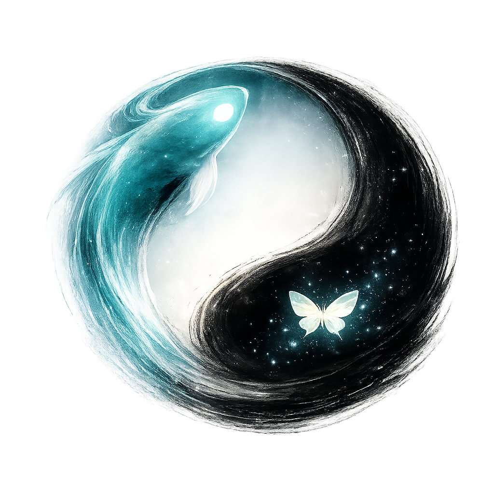
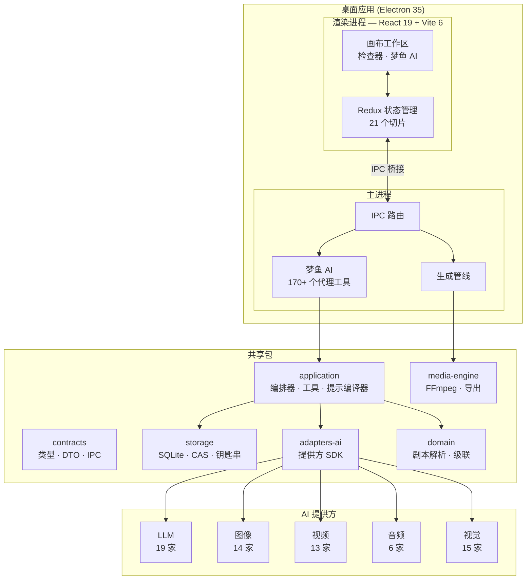

<div align="center">

<!-- HERO BANNER -->


<br>

# 梦鱼 Lucid Fin

### AI 驱动的影视制作桌面应用

_从剧本到镜头，从镜头到场景，从场景到影片 — 全程 AI 驱动。_

<p>
  <a href="#-功能特性">功能特性</a> &nbsp;&bull;&nbsp;
  <a href="#-截图">截图</a> &nbsp;&bull;&nbsp;
  <a href="#-架构">架构</a> &nbsp;&bull;&nbsp;
  <a href="#-快速开始">快速开始</a> &nbsp;&bull;&nbsp;
  <a href="README.md">English</a>
</p>

<p>
  
  
  
  
  
</p>

<p>
  
  
  
  
  
  
  
</p>

</div>

---

## 功能特性

<table>
  <tr>
    <td width="33%" valign="top">
      <h4>画布工作区</h4>
      <p>节点式可视化编辑器 — 图像、视频、音频、文本和背景板节点通过有向边连接。拖拽、连接、生成。</p>
    </td>
    <td width="33%" valign="top">
      <h4>梦鱼 AI</h4>
      <p>内置 AI 助手，拥有 170+ 个工具。拆解剧本、管理角色、应用预设、分析图像、生成媒体 — 全部通过对话完成。</p>
    </td>
    <td width="33%" valign="top">
      <h4>预设系统</h4>
      <p>8 类预设轨道（主体、风格、摄影机、灯光、色彩、情绪、构图、特效），支持每条目强度控制和多参数调节。</p>
    </td>
  </tr>
  <tr>
    <td width="33%" valign="top">
      <h4>视频克隆模式</h4>
      <p>导入视频 &rarr; 自动检测场景切换 &rarr; 提取关键帧 &rarr; 视觉 AI 描述 &rarr; 生成可编辑 AI 分镜画布。</p>
    </td>
    <td width="33%" valign="top">
      <h4>视觉分析</h4>
      <p>从任意图像反向推理提示词。提取画风、灯光、色彩、情绪、构图 — 支持 15+ 家视觉 AI 提供方。</p>
    </td>
    <td width="33%" valign="top">
      <h4>情感向量 TTS</h4>
      <p>8 维情感控制（开心、悲伤、愤怒、恐惧、惊讶、厌恶、轻蔑、中性），为语音合成赋予丰富表现力。</p>
    </td>
  </tr>
  <tr>
    <td width="33%" valign="top">
      <h4>剧本集成</h4>
      <p>导入 Fountain/FDX/纯文本剧本。自动拆解为镜头。转换为画布节点并关联角色、场景、装备。</p>
    </td>
    <td width="33%" valign="top">
      <h4>跨帧连续性</h4>
      <p>视频生成后自动提取最后一帧，设置为下一节点的首帧参考 — 实现视觉无缝过渡。</p>
    </td>
    <td width="33%" valign="top">
      <h4>专业导出</h4>
      <p>导出为 CapCut、FCPXML、EDL 格式。兼容 Final Cut Pro、DaVinci Resolve、Premiere Pro。</p>
    </td>
  </tr>
</table>

<details>
<summary><strong>更多功能...</strong></summary>

- **双提示词系统** — 每个节点支持独立的图像提示词和视频提示词
- **角色与装备管理** — 参考图、结构化外观字段，确保角色一致性
- **口型同步** — 视频生成后自动口型同步，支持云端 API 和本地 Wav2Lip
- **自适应工具执行** — 基于成功率自动调节并发度（1-8 路并行调用）
- **上下文压缩** — 借鉴 Codex/Claude Code 的 handoff 式摘要，附带防循环保护
- **镜头模板** — 预定义镜头设置一键应用到多个节点
- **批量工具操作** — 大部分画布工具支持多节点批量执行
- **国际化** — 完整的中英文本地化

</details>

---

## 截图

> 截图待补充

<details open>
<summary><strong>画布工作区</strong></summary>
<br>

<em>节点式画布，包含图像/视频/音频节点、预设轨道和生成控制</em>
</details>

<details>
<summary><strong>梦鱼 AI</strong></summary>
<br>

<em>AI 助手，支持斜杠命令、工具调用、流式响应和上下文管理</em>
</details>

<details>
<summary><strong>预设系统</strong></summary>
<br>

<em>8 类预设轨道，带强度滑块和每条目参数控制</em>
</details>

<details>
<summary><strong>设置与提供方</strong></summary>
<br>

<em>多提供方配置：LLM、图像、视频、音频、视觉 AI</em>
</details>

---

## 支持的 AI 提供方

<table>
  <tr>
    <th>类别</th>
    <th>提供方</th>
  </tr>
  <tr>
    <td><strong>LLM</strong></td>
    <td>
      
      
      
      
      
      
      
      
      <br>
      
      
      
      
      
      
      
      
      
    </td>
  </tr>
  <tr>
    <td><strong>图像</strong></td>
    <td>OpenAI GPT Image、Google Imagen 4、Recraft、Ideogram、Replicate、fal、Stability、Together AI、硅基流动、智谱 CogView、通义万象、快手可图、阶跃星辰、火山引擎 Seedream</td>
  </tr>
  <tr>
    <td><strong>视频</strong></td>
    <td>Google Veo 2、Runway Gen-4、Luma Dream Machine、Pika、可灵、MiniMax 海螺、生数 Vidu、Replicate、fal、硅基流动、智谱 CogVideoX、通义视频、火山引擎豆包视频</td>
  </tr>
  <tr>
    <td><strong>音频</strong></td>
    <td>ElevenLabs、MiniMax TTS、火山引擎 TTS、Azure TTS、Google Cloud TTS、OpenAI TTS</td>
  </tr>
  <tr>
    <td><strong>视觉</strong></td>
    <td>15+ 家提供方 — 与 LLM 列表相同（OpenAI、Gemini、Claude、通义千问、Grok、Mistral、DeepSeek 等）</td>
  </tr>
</table>

---

## 架构



<details>
<summary><strong>目录结构</strong></summary>

```
apps/
  desktop-main/         Electron 主进程 — IPC、生成管线、梦鱼 AI
  desktop-renderer/     React + Vite 前端 — 画布、面板、Redux 状态管理

packages/
  contracts/            共享 TypeScript 类型、DTO、IPC 通道定义
  storage/              SQLite 数据库、内容寻址资产存储、系统钥匙串
  adapters-ai/          AI 提供方适配器（图像、视频、音频、LLM、视觉）
  application/          梦鱼 AI 编排器、170+ 个代理工具、提示编译器
  domain/               剧本解析器、提示组装器、级联逻辑
  media-engine/         FFmpeg 工具、Ken Burns 效果、拼接器、NLE 导出

.github/workflows/     CI 管线 — 每次 push/PR 自动类型检查、测试、代码规范
e2e/                    Playwright 端到端测试
docs/                   AI 视频提示词指南、规划文档
```

</details>

---

## 快速开始

```bash
# 克隆
git clone https://github.com/NAinfini/Inifni-Lucid-Fin.git
cd Inifni-Lucid-Fin

# 安装依赖
npm install

# 开发环境
npm run dev

# 运行测试
npm test

# 构建
npm run build
```

<details>
<summary><strong>环境要求</strong></summary>

| 要求     | 版本                    |
| -------- | ----------------------- |
| Node.js  | >= 20                   |
| npm      | >= 10                   |
| FFmpeg   | >= 6（视频处理需要）    |
| 操作系统 | Windows / macOS / Linux |

</details>

<details>
<summary><strong>AI 提供方配置</strong></summary>

1. 打开 **设置**（齿轮图标）
2. 选择提供方标签：**LLM**、**图像**、**视频**、**音频** 或 **视觉**
3. 输入 API 密钥并点击 **保存**
4. 将提供方设为当前使用
5. 添加自定义提供方：点击 **+ 添加自定义提供方**，输入名称、基础 URL 和模型

</details>

---

## CI / CD

每次 push 和 pull request 都会通过 GitHub Actions 运行完整 CI 管线：

| 任务         | 内容                                                            |
| ------------ | --------------------------------------------------------------- |
| **类型检查** | `tsc --noEmit` — 检查 `contracts`、`application`、`adapters-ai` |
| **测试**     | `vitest run` — 运行所有单元测试和集成测试                       |
| **代码规范** | `eslint` — 零警告策略                                           |

详见 [`.github/workflows/ci.yml`](.github/workflows/ci.yml)。

---

## Star 趋势

<div align="center">

[](https://star-history.com/#NAinfini/Inifni-Lucid-Fin&Date)

</div>

---

## 许可证

专有软件 — 版权所有。

---

<div align="center">

**为 AI 电影人倾力打造**

</div>
