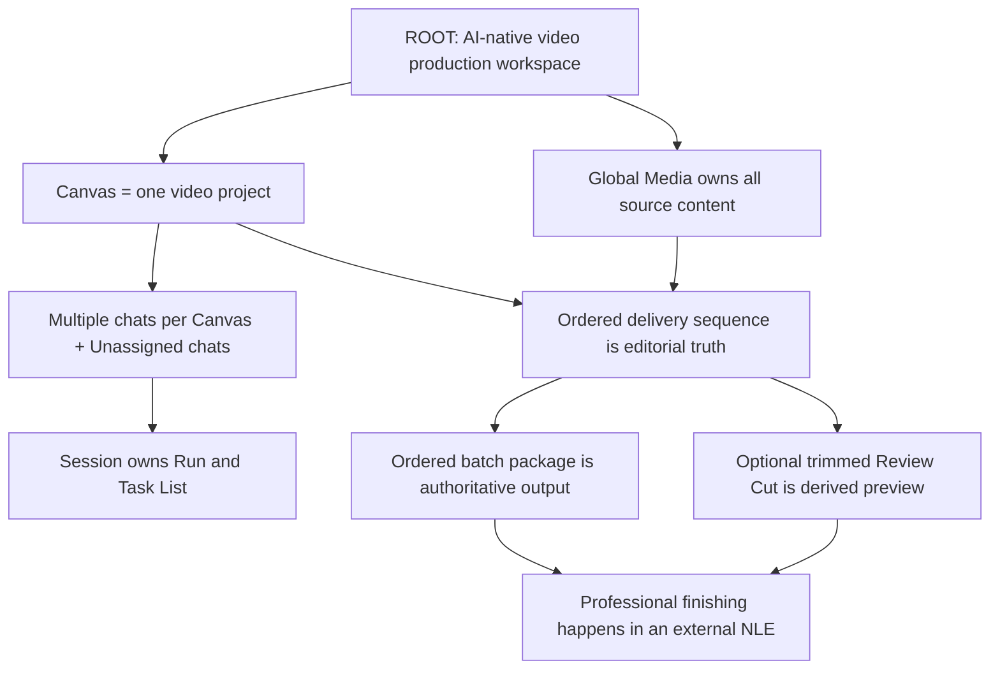

> **Historical archive — not current product documentation.**
>
> Archived during the 2026-08-28 canonical cutover. This inventory describes the removed Canvas,
> Redux, multi-provider, migration, and resource-manager application and must not guide current work.

# Lucid Fin Product Tree and Drift Audit

This document maps the product that currently exists in the repository against the confirmed root in
[`PRODUCT.md`](../PRODUCT.md). It is an inventory and pruning guide, not a promise to preserve every
implemented feature.

## Reading the Tree

| Mark      | Meaning                                                            | Default action                  |
| --------- | ------------------------------------------------------------------ | ------------------------------- |
| `ROOT`    | Confirmed central product fact                                     | Protect                         |
| `TRUNK`   | Required to deliver the root flow                                  | Keep and finish                 |
| `BRANCH`  | A coherent supporting capability                                   | Keep if it remains subordinate  |
| `LEAF`    | A useful concrete operation                                        | Keep when used and maintainable |
| `RESHAPE` | Useful code whose product boundary is wrong or too large           | Narrow and reuse                |
| `DRIFT`   | Competes with or contradicts the root                              | Remove or redesign              |
| `BROKEN`  | Intended capability exists but its user path is missing or failing | Fix before claiming             |
| `DEAD`    | Duplicate or unreferenced surface                                  | Delete                          |

Drift distance is qualitative:

- **0 — aligned:** directly expresses the root.
- **1 — supporting:** necessary infrastructure or a healthy subordinate feature.
- **2 — optional complexity:** useful, but it must earn its ongoing cost.
- **3 — structural drift:** creates a competing product model or a false primary workflow.

## The Confirmed Root



## Current Tree at a Glance

```text
Lucid Fin
├─ Workspace and Canvas                                      [TRUNK, distance 0]
│  ├─ Canvas lifecycle and settings                         [BRANCH]
│  ├─ Node graph: text/image/video/audio/backdrop           [BRANCH]
│  ├─ Inspector, notes, dependencies, search                [BRANCH]
│  └─ Ordered Delivery list                                 [TRUNK, distance 0]
├─ Global Media                                              [TRUNK, distance 0]
│  ├─ CAS content and logical entries                       [BRANCH]
│  ├─ folders/import/query/preview/metadata                  [LEAVES]
│  └─ authoritative Delivery package                        [IMPLEMENTED]
├─ Commander AI                                              [TRUNK, distance 0]
│  ├─ Canvas-grouped and Unassigned sessions                [BRANCH]
│  ├─ durable Run/Event/Task List execution                 [BRANCH]
│  ├─ stable typed tools + guarded public event pipeline    [BRANCH]
│  ├─ Agent/subagent/Tool Program activity tree             [BRANCH]
│  ├─ model-directed decisions, attachments, approvals      [LEAVES]
│  └─ Canvas-grouped sidebar is the sole chat manager        [TRUNK]
├─ AI media production                                       [TRUNK, distance 0]
│  ├─ Prompt Assembly                                       [BRANCH]
│  ├─ image/video/audio generation and recovery             [BRANCH]
│  ├─ grading, repair, lineage, continuity                   [BRANCH]
│  └─ broad provider catalog                                [BRANCH, distance 2; pruning deferred]
├─ Ordered delivery                                          [TRUNK, IMPLEMENTED]
│  ├─ selected video per shot                               [IMPLEMENTED]
│  ├─ order + trim + embedded-audio preference              [IMPLEMENTED]
│  ├─ exact Delivery approval and atomic package            [IMPLEMENTED]
│  └─ lightweight Review Cut engine and UI                  [IMPLEMENTED]
├─ Production knowledge                                      [BRANCH, distance 1]
│  ├─ characters/equipment/locations                        [LEAVES]
│  ├─ scripts/styles/shot templates/presets                 [LEAVES]
│  └─ skills and process guides                             [LEAVES]
├─ Reliability and operations                                [BRANCH, distance 1]
│  ├─ SQLite canonical schema/CAS/keychain                   [LEAVES]
│  ├─ backup/restore/snapshots/recovery                      [LEAVES]
│  ├─ Logger and durable event ledgers                      [LEAVES]
│  └─ Redux/IPC/undo/persistence                            [LEAVES]
└─ Removed structural drift
   ├─ Series/Episodes parallel project model                 [REMOVED]
   ├─ professional multitrack Timeline                       [REMOVED]
   ├─ final mastered-video renderer as primary delivery      [REMOVED]
   ├─ Video Clone and semantic search                        [REMOVED]
   └─ Ken Burns, proxies, subtitles, auxiliary stitchers     [REMOVED]
```

## Confirmed Pruning Decisions

- Video Clone and semantic search are removed from the supported product path. They must not gain new
  UI, workflows, or documentation as first-release capabilities.
- Ken Burns, proxy generation, subtitle burn-in, and auxiliary stitching are removed; FFmpeg probing,
  evaluation support, and the narrow Review Cut remain.
- The read-only API server is removed from the supported product surface.
- Commander tuning, Guides and Skills, Process Prompts, deep presets, and shot templates remain as
  power-user capabilities, progressively disclosed under Advanced controls.
- Canvas document portability is deferred. The approved Delivery package is the portable handoff.
- Provider pruning is deferred until an explicit initial supported-provider list is selected.

## Branch 1 — Workspace, Canvas, and Nodes

**Assessment: healthy trunk.** Canvas already behaves like the project boundary and should become the
only project grouping concept.

### Existing branches and leaves

- Canvas lifecycle: create, open, switch, search, sort, rename, archive, restore, separately confirmed
  permanent delete, and project settings.
- Canvas graph: directional nodes and edges with pan, zoom, minimap, grid, snap, selection, and layout.
- Node types: text, image, video, audio, and backdrop.
- Node operations: create, duplicate, copy, cut, paste, delete, lock, collapse, tag, change color,
  resize, move, connect, disconnect, and batch update.
- Media-node operations: configure prompt and provider parameters, select a generated variant, preserve
  generation history, control seed, set references, and set video first/last frames.
- Context surfaces: Inspector, dependencies, notes, node search, generation history, prompt provenance,
  entity references, and advanced parameters.
- Canvas support: undo/redo, differential persistence, snapshot restoration, deferred document
  import/export, large-canvas LOD, indexed node lookup, and backdrop containment optimization.

### Alignment

- Node graphs are an excellent project ideation and production surface. They answer **what material
  exists and how the creative facts relate**.
- Nodes must reference global Media rather than own duplicate media bytes.
- Canvas document portability is deferred; it is not the authoritative media handoff.

### Drift and pruning

- The former `SeriesManager` hierarchy and its execution/storage surface have been removed; Canvas is
  the only project boundary.
- The Canvas view switcher is now mounted and intentionally exposes only Canvas and Delivery. The
  former Timeline, subtitle, multitrack-audio, and placeholder Materials surfaces have been removed.

## Branch 2 — Global Media and Content Management

**Assessment: healthy trunk; authoritative handoff is being completed through Delivery packages.**

### Existing branches and leaves

- Content-addressed storage for immutable source bytes and technical metadata.
- Separate logical Media entries, names, folders, tags, and usage references.
- Image, video, audio, and document/text-related assets.
- Import by picker, buffer, drag-and-drop, and generated-provider result.
- Browse, folder tree, filter, sort, search, preview, inspect metadata, rename, copy, move, delete, and
  single-item export.
- Asset-content inspection, media probing, content hashes, duplicate-safe storage, and garbage
  collection roots.
- Host-derived Delivery package export that resolves only the exact approved CAS contents.

### Alignment

- This branch directly expresses the global Media ownership rule.
- Images, videos, audio, scripts, subtitles, prompts, and reference documents should all remain source
  material that projects link to, not project-owned copies.

### Remaining or dead leaves

- Arbitrary renderer-selected batch export is not the authoritative handoff and is being removed in
  favor of the approved host-derived Delivery package.
- Semantic search is removed rather than retained as an incomplete invisible path.
- Old asset toolbar and context-menu implementations coexist with the newer browser but are not
  mounted. They are dead duplicate leaves.

## Branch 3 — Commander Chats and AI Management

**Assessment: healthy trunk; the confirmed session-management defects have been repaired.**

### Existing branches and leaves

- Multiple persistent Commander sessions, active session selection, session title, timestamps, and
  Canvas grouping.
- Unassigned sessions and Canvas-default sessions.
- Lazy transcript loading, session rename/delete, chat search, snapshots, and snapshot restore.
- Durable root, subagent, and Tool Program runs with ordered public events, safe progress, resource
  usage, pause/resume/cancel, interruption recovery, and run-tree hydration.
- Per-session current run and per-session Task List ownership.
- Message attachments, selected nodes, files, queued messages, copy actions, Markdown, artifact previews,
  questions, tool confirmations, and cancellation banners.
- Model-directed creative decisions through typed tools, including optional structured choices and
  free-text answers without a host-defined option count or phrase classifier.
- One frozen capability catalog per Run and one execution pipeline for schema, permission, cost,
  confirmation, CAS, execution, normalized results, and durable events.
- Event-derived model context, explicit token/tool-call/time/cost budgets, provider selection,
  checklists, slash commands, on-demand skills and telemetry.
- A single narrow Agent Activity control for Task Lists, root Runs, subagents, and Tool Programs,
  including public objectives, progress, tools, artifacts, blockers, resources, and subtree control.
- Production-plan decisions through a typed model decision and exact host-side revision validation;
  ordinary chat remains unconstrained model input rather than a local approval phrase table.

### Alignment

- Session-owned Run and Task List state is the correct execution model.
- The left Canvas-grouped sidebar is the correct single chat-management surface.
- A chat's default Canvas is project context, not exclusive data ownership. A Canvas explicitly added
  to one message grants read context only for that accepted Run; each write outside the default Canvas
  requires a separate tool-call confirmation.

### Repaired boundaries

- Historical hydration is atomic; load failure leaves the active chat and Canvas unchanged.
- Session delete and move have one main-process path and reject active runs or unfinished Task Lists.
- SQLite summaries provide accurate message counts before lazy transcript hydration.
- The in-chat Canvas-scope/history controls are gone; the Canvas-grouped sidebar is authoritative.
- Task progress lives inside the click-controlled, narrow Agent Activity control, participates in
  normal layout, appears only during active work, and no longer covers the transcript.
- Canvas deletion is archive-first. Permanent deletion is blocked by related active work, moves its
  chats to Unassigned, and does not delete global Media.

## Branch 4 — Task Lists, Prompt Assembly, and Approvals

**Assessment: strong supporting trunk; some orchestration is heavier than the root requires.**

### Existing branches and leaves

- Durable Task Lists, tasks, dependencies, attempts, events, decisions, artifacts, evaluations, leases,
  row-version checks, cancellation, retry, pause/resume, and restart recovery.
- Registered workflows for movie production, media generation, audio production, and style extraction.
- Session ownership prevents unrelated chats on the same Canvas from sharing Task Lists.
- Prompt Assembly prepares, binds, hashes, persists, submits, fails, and cancels the exact
  provider-facing prompt.
- Production Plan, Visual Constitution, and delivery/export approval gates with exact revision/hash
  checks.
- Provider-submission receipts, idempotency keys, ambiguous-result handling, artifact lineage, and
  bounded repair/regeneration.
- Human questions and decisions are durable when attached to a Task List.

### Alignment

- Durable execution is a key product differentiator and must remain.
- Approval should protect costly or irreversible work without forcing the user into redundant form
  controls. Plan revision belongs in normal chat; visual direction and final delivery require visible
  exact-subject decisions.

### Optional complexity and drift

- The movie-production graph now persists every valid scene; its former 24-shot truncation has been
  removed. Commander continuation safety is bounded independently from project size.
- Many movie tasks are external Commander continuations rather than ordinary engine-pumped handlers,
  which makes the graph heavier and more fragile than the media/audio durable handlers.
- Future pruning should preserve attempts, artifacts, approvals, and recovery while simplifying the
  oversized fixed movie graph around the ordered delivery sequence.

## Branch 5 — AI Media Production

**Assessment: healthy trunk and a core competitive capability.**

### Existing branches and leaves

- Image, video, audio, music, speech, and vision adapters.
- Text nodes, script parsing, text transformation/analysis, prompt compilation, and visual
  descriptions.
- Durable image/video/audio generation with provider selection, model parameters, resolution,
  variants, seeds, references, first/last frames, cost checks, cancellation, and provider polling.
- Media probing, CAS import, logical entry creation, generated-asset metadata, and Canvas linking.
- Vision grading, ordered evidence, scene-cut and frame sampling, continuity checks, accepted/repaired/
  regenerated/human-review verdicts, and immutable evaluation lineage.
- Style extraction, visual auditions, reference generation, and Visual Constitution locking.
- Cross-frame continuity using prior video frames as later generation references.

### Alignment

- Generation, evaluation, continuity, and provenance are central branches, not optional decorations.
- Text, image, video, and audio management should feed Canvas and global Media; none should introduce a
  second asset store or direct provider path.

### Optional complexity

- Style transfer and advanced vision analysis are specialist leaves but are not required for the first
  root flow. Video Clone and semantic search are removed from this tree.
- Audio generation is aligned as source-media production. Multitrack mixing inside Lucid Fin is not.

## Branch 6 — Provider Management

**Assessment: necessary branch with an oversized leaf canopy.**

### Existing branches and leaves

- Separate provider groups for LLM, image, video, audio, and vision.
- API-key, OAuth, custom endpoint, and local-model runtimes.
- Active-provider selection, base URL, editable model, optional reasoning strength, protocol, context
  window, capability flags, and provider-specific defaults.
- Secure keychain storage, isolated OAuth runtime, login/logout/status/usage, host allowlists, URL
  policy, connection test, reset, and remove.
- Pricing and cost estimates, capability resolution, provider health, retries, timeouts, and streaming.
- A very broad catalog spanning hosted and local providers.

### Alignment

- Provider choice is required because media generation is the product engine.
- Model and strength are free-text inputs for API and OAuth where supported; empty strength means omit
  it. Known unsupported combinations must fail clearly before sending.

### Optional complexity

- The provider catalog is much broader than the root requires and has a high maintenance surface.
- Provider pruning is deferred until the product has an explicit initial supported-provider list.
- Provider health is currently in-memory and resets on restart. It is diagnostic, not durable truth.
- Provider administration should remain a human settings action; Commander may inspect capabilities
  and use configured providers but must not handle secrets.

## Branch 7 — Production Knowledge

**Assessment: aligned supporting branches.**

### Existing branches and leaves

- Character profiles, appearance, personality, variants, reference images, equipment/loadouts, and
  Canvas usage references.
- Equipment records, variants, references, and Canvas links.
- Location records, mood, weather, lighting, variants, references, and Canvas links.
- Entity folders, copy/move/delete, soft-delete safety, and cleanup of Canvas references.
- Scripts and screenplay parsing, shot extraction, color/style records, shot templates, generation
  presets, eight preset-track categories, process prompts, and skill guides.
- Prompt provenance and reference-evidence roles.

### Alignment

- These facts improve identity, style, and continuity and should remain subordinate to a Canvas.
- They are production knowledge, not alternative project roots.

### Optional complexity

- Custom skills, editable process prompts, deep preset tracks, and template import/export are power-user
  leaves. They remain available behind Advanced controls instead of competing with ordinary settings.

## Branch 8 — Ordered Delivery and Review Cut

**Assessment: this is the required trunk and is now the active replacement for Final Export.**

### Root-required leaves

- One selected video asset for each deliverable shot.
- Explicit shot order with drag-to-reorder.
- Non-destructive trim-in and trim-out per selected video.
- Embedded-audio enabled/disabled preference per selected video.
- Validation for missing, failed, unaccepted, or duplicate shot selections.
- Exact delivery approval over sequence, selected hashes, trims, and naming policy.
- Batch export with zero-padded order prefixes, stable shot IDs, readable names, `manifest.csv`, and
  `manifest.json`.
- Optional Review Cut: trim, normalize basic compatibility, preserve or silence embedded audio, hard
  concatenate, report progress, cancel, and regenerate.

### Implemented foundation

- Canvas now owns exactly one revision-CAS Ordered Delivery sequence.
- The first Delivery package is video-only. Audio and text remain global Media until a dedicated
  handoff leaf is deliberately added.
- The renderer exposes a reachable Delivery list with source selection, reorder, trim, and embedded
  audio preference backed by authoritative technical metadata.
- SQLite owns Delivery approvals, `batch_export` attempts, `delivery_package` artifacts, invalidation,
  recovery, and migration of safe historical output to `review_cut_output`.
- The media engine now has a narrow Review Cut path for trim, normalization, embedded audio or silence,
  hard cuts, progress, and cancellation.

### Structural drift removed

- Multitrack audio editing, audio-clip positioning, track gain/mute, subtitle cue documents, subtitle
  timing, subtitle burn-in, and the professional Timeline renderer have been removed from Canvas,
  storage, renderer, TaskExecution, media-engine, and host ownership.
- A rendered MP4/MOV must not be the sole or authoritative delivery. The source batch manifest is
  authoritative; Review Cut is derived.
- The old Timeline/Materials switcher and placeholder are gone. Approved-package export and the
  optional Review Cut are explicit user actions in the Delivery approval surface.

## Branch 9 — Store, Persistence, and Recovery

**Assessment: necessary infrastructure with obsolete parallel state removed.**

### Existing branches and leaves

- Redux slices for Canvas, assets, Commander, Task Lists, characters, equipment, locations, presets,
  shot templates, settings, skills, logger, UI, and toast.
- Middleware for IPC, durable task starts, differential Canvas persistence, undo/redo, and Delivery CAS
  persistence.
- SQLite repositories for Canvas, nodes, edges, Media, folders, sessions, runs, events, Task Lists,
  attempts, artifacts, evaluations, prompts, entities, presets, templates, snapshots, and settings.
- CAS, keychain, FTS5 keyword search, garbage collection, backup scheduler, restore, repair, strict schema
  validation, interrupted-run failure, and provider-attempt recovery.

### Alignment

- Redux is a renderer projection and interaction state, not business authority.
- SQLite, CAS, Commander events, and Task events own durable truth.
- Restart recovery must fail closed and never silently resubmit ambiguous provider work.

### Drift and cleanup

- Ordered-delivery persistence is canonical, and TaskExecution, package, Review Cut, renderer, and
  host consumers are cut over.
- The development database has been migrated and flattened. `SCHEMA_SQL` is now the sole storage
  definition; fresh databases are created directly from it, while an existing database with missing,
  extra, or changed schema objects fails closed before bootstrap writes.
- The competing Series/Episodes project model and detached Storyboard Redux state have been removed.
- Do not reintroduce a development migration chain. Before release, intentional schema changes must
  use an explicitly approved data-cutover plan and then return the repository to one canonical schema.

## Branch 10 — Logger, Diagnostics, and Reliability

**Assessment: healthy supporting branch.**

### Existing branches and leaves

- Renderer log state with debug/info/warn/error levels, category, message, detail, bounded retention,
  filtering, expansion, copy entry, copy all, and clear.
- Main-process structured logs across IPC, Commander, generation, providers, storage, and recovery.
- Error boundaries, toasts, provider health, connection tests, usage counters, token statistics, tool
  telemetry, and a Commander telemetry command.
- Backup/restore, snapshots, manual capture, snapshot history, restore confirmation, and entity/Canvas
  reload after restoration.

### Alignment

- Logger helps users and developers diagnose work, but it is not a workflow ledger.
- Durable Commander and Task events remain the source of truth for execution and audit.
- `logger.list` is correctly excluded from Commander tools; secret or diagnostic administration stays
  human-controlled.

## Branch 11 — Settings and Application Management

**Assessment: necessary, broad, and partly power-user oriented.**

### Existing branches and leaves

- Appearance and language.
- Provider and OAuth management.
- Skills and guide content.
- Process-prompt customization.
- Commander resource budgets for tokens, tool calls, wall time, and cost; context/output safety,
  temperature, sessions, messages, undo depth, logs, save delay, clipboard watch, and generation
  concurrency.
- Canvas defaults: style, output resolution/aspect, provider overrides, and reference presets.
- Storage, logs, embedding cleanup, vacuum, backup, and restore.
- Usage, provider/tool/session/generation/token statistics.
- Update/about information and onboarding.

### Alignment and pruning

- Provider, storage, backup, language, and essential Commander controls are healthy.
- Low-level tuning is a power-user leaf. Defaults should carry the root flow without requiring users to
  understand agent internals.
- Commander tuning, Guides and Skills, and Process Prompts are grouped under a collapsed Advanced
  disclosure. The active advanced section remains visible when selected.
- Settings must not become a second place for per-Canvas project decisions already owned by Canvas.

## Branch 12 — Explicit Drift and Dead Growth

### Structural drift removed

1. **Series/Episodes as a parent project model — removed.** Canvas exclusively owns the project
   boundary.
2. **Professional multitrack Timeline — removed.** Ordered Delivery retains only order, trim, and
   embedded-audio preference.
3. **Final mastered-video export as the primary result — removed.** Batch source delivery is
   authoritative and Review Cut is optional.
4. **Video Clone and semantic search — removed.** Neither has a supported first-release user path.
5. **Ken Burns, proxy generation, subtitle burn-in, and auxiliary stitching — removed.** FFmpeg
   probing, evaluation support, and the narrow Review Cut path remain.
6. **Read-only API server — removed.** It is not a supported external automation surface.

### Overgrown optional canopy

- Dozens of provider adapters and their maintenance matrix, pending an explicit supported-provider list.
- Editable skills/process prompts, extensive agent tuning, deep presets, and shot templates, all kept
  behind Advanced controls.
- Style transfer and advanced vision analysis.
- Deferred Canvas document portability, full data export, and snapshots.

These are not automatically wrong. They should remain only when the trunk is complete and the leaf has
a reachable user flow, a clear owner, tests, and ongoing value.

### Removed unsupported growth

- Video Clone, semantic search, Ken Burns, proxy generation, subtitle burn-in, auxiliary stitchers,
  and the read-only API server do not have a supported user path.

## Drift Scorecard

| Domain                                     | Distance | Verdict                                     |
| ------------------------------------------ | -------: | ------------------------------------------- |
| Canvas project workspace                   |        0 | Protect                                     |
| Global Media/CAS                           |        0 | Protect; approved batch handoff implemented |
| Commander sessions and Task Lists          |        0 | Protect; session management repaired        |
| Image/video/text/audio generation          |        0 | Protect                                     |
| Prompt Assembly, evaluation, recovery      |        1 | Keep as core support                        |
| Characters/equipment/locations             |        1 | Keep as production knowledge                |
| Logger, storage, backup, settings          |        1 | Keep subordinate                            |
| Presets/templates/guides                   |        2 | Keep selectively                            |
| Broad provider catalog                     |        2 | Prune after supported list is explicit      |
| Style transfer/advanced vision tools       |        2 | Optional after trunk completion             |
| Video Clone/semantic search/media utilities|        0 | Removed                                     |
| Series/Episodes parent hierarchy           |        0 | Removed                                     |
| Full Timeline and multitrack editing       |        0 | Removed                                     |
| Final merged movie as authoritative output |        0 | Replaced by optional Review Cut             |

## Pruning Order

1. **Freeze the root.** Use `PRODUCT.md` for all new feature and design decisions.
2. **Repair the chat trunk.** Fix historical hydration, runtime delete registration, persisted message
   counts, Canvas-grouped drag/drop, and removal of duplicate in-chat scope/history controls.
3. **Create the ordered-delivery model.** Extract the useful video order/trim/embedded-audio facts from
   Timeline into one smaller canonical sequence.
4. **Make batch export reachable.** Add selection, deterministic order-prefixed naming, manifests, and
   explicit external-NLE handoff.
5. **Narrow rendering.** Reuse the current trim/concat/recovery pieces for an optional Review Cut and
   delete multitrack/subtitle/NLE behavior that no longer has a product owner.
6. **Remove parallel roots and dead UI.** Completed for Series/Episodes, placeholder Materials,
   duplicate asset surfaces, and stale Storyboard/Timeline state.
7. **Keep storage flat.** The development migration chain is gone; preserve one canonical schema and
   require an explicit, verified cutover before any future structural change.
8. **Reassess optional leaves.** Provider breadth and specialist tools survive only if they have a
   reachable flow and do not slow the trunk.

## Definition of a Healthy New Leaf

A proposed feature may grow only when all answers are yes:

1. Does it help the user direct AI, generate/evaluate media, organize a Canvas, or hand off ordered
   source material?
2. Does it have exactly one authoritative owner?
3. Does it reuse the existing Session/Run/Task List, Prompt Assembly, and Media paths rather than add a
   parallel workflow?
4. Is its user entry reachable and understandable without exposing implementation concepts?
5. Can it be removed without corrupting unrelated durable data?
6. Does it avoid turning Lucid Fin into a professional NLE?

If not, it is not a leaf on this tree yet.
