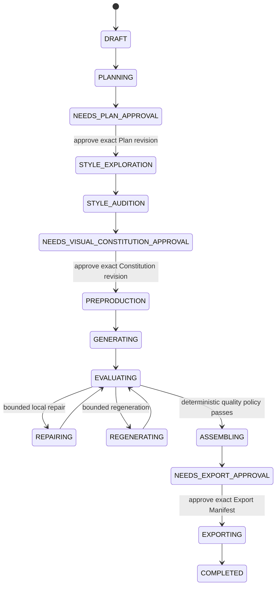

# Persistent Hybrid AI Video Workflow

Status: **Approved implementation baseline**
Date: 2026-08-01
Scope: one-line concept through recoverable planning, generation, evaluation, repair, assembly, and export

## 1. Approved decisions

1. A `WorkflowAggregate` in SQLite is the single source of truth. Chat, Redux, localStorage, model context, and natural-language summaries are rebuildable projections.
2. The system uses a deterministic workflow shell around an AI creative core. The host owns state transitions, approvals, budgets, permissions, idempotency, and recovery. AI produces structured plans, creative specifications, evaluations, and repair deltas.
3. There are exactly three non-bypassable user approval gates:
   - Production Plan
   - Visual Constitution
   - Final Export
4. Within already approved story, style, budget, provider/model, concurrency, and retry bounds, AI may plan, generate, grade, repair, and regenerate autonomously.
5. Any boundary change pauses the run and asks the user. The system must not silently expand cost, alter story/style, or invent extra approval gates.
6. TypeScript remains pinned. Other dependency upgrades are handled independently from this workflow migration.

## 2. Why the current system loses control

Runtime truth is split across workflow tables, Commander messages, Redux/localStorage, `PromptStore`, `ProcessPromptStore`, renderer-owned skills, and narrative workflow guides. `workflow.manage expandIdea` returns instructions rather than a persisted, hashed plan. `commander.askUser` is a transient chat question rather than a recoverable approval. `WorkflowEngine.start()` immediately pumps executable tasks, so it cannot reliably prevent pre-approval side effects.

This creates four recurring failures:

- compaction or restart removes decisions and the model guesses from a summary;
- duplicated workflow/prompt/skill rules have uncertain precedence;
- tool visibility and permission are not tied tightly enough to the current stage;
- generation has no immutable attempt, evidence, score, and revision chain explaining where output drift began.

## 3. Target state machine



Global side states are limited to `PAUSED`, `RECOVERING`, `FAILED`, and `CANCELLED`. Rejecting an approval creates a new revision and returns to the corresponding stage; it does not add another gate. A material edit to the Plan, Visual Constitution, or final assembly invalidates the related approval.

## 4. Persistence model and invariants

Use additive migrations on the existing workflow tables and introduce:

- `workflow_events`: strictly ordered per-run events with actor and correlation/causation IDs;
- `workflow_documents`: immutable revisions of Plan, Script, Shot Plan, Visual Constitution, Generation Spec, Repair Delta, and Export Manifest;
- `workflow_approvals`: one of the three gate keys, exact subject revision/hash, manifest hash, resume-token hash, and resolution state;
- `workflow_task_attempts`: every provider call, provider task ID, input hash, cost, usage, error, and recovery state;
- `workflow_evaluations`: rubric version, scores, timestamp/frame evidence, defects, and proposed action;
- `context_checkpoints`: validated structured facts plus a non-authoritative conversation summary;
- `prompt_asset_revisions` and `prompt_bindings`: exact prompt/rubric/provider-adapter versions locked by a run;
- `style_catalog_entries` and `style_preview_assets`: illustrative catalog cards and project auditions.

Required invariants:

- state, document revision, approval, budget reservation, and event append update in one transaction;
- approval accepts only the currently pending gate's exact revision, content hash, manifest hash, resume-token hash, and run row version;
- provider idempotency keys derive from run, definition version, stage, task, subject revision, and input hash;
- repair never overwrites an artifact; it creates a new attempt/revision with `supersedes` and provenance;
- an ambiguous non-idempotent provider submission enters `recovery_required` and is never blindly resent;
- clearing chat or localStorage cannot delete, roll back, or advance workflow truth.

## 5. AI autonomy and ask-user policy

AI has bounded creative freedom, not state-machine freedom.

AI may autonomously:

- choose low-risk defaults that preserve intent and disclose them as Plan assumptions;
- draft dialogue, shot structure, composition, lighting, movement, and pacing;
- propose `pass`, `repair`, `regenerate`, or `human_review` from structured evidence;
- apply a Repair Delta or regenerate while approved cost and attempt limits remain.

AI must use a persisted `askUser` decision when:

- missing information materially changes story, audience, identity, style, or budget;
- an assumption is rejected;
- the next action exceeds approved cost, attempt, provider/model, or timing bounds;
- a provider submission cannot be recovered safely;
- evidence conflicts and deterministic policy requires human review.

Each question uses a stable `decision_key + subject_revision`. An answered decision is not asked again. Routine technical recovery and harmless defaults do not interrupt the user. Chat approval language never grants a workflow approval; only the host approval command does.

## 6. Workflow, prompts, skills, and Settings

All remain, with non-overlapping responsibilities:

| Component    | Sole responsibility                                                              | Must not become                               |
| ------------ | -------------------------------------------------------------------------------- | --------------------------------------------- |
| Workflow     | states, dependencies, three gates, budgets, retries, recovery, permissions       | a narrative prompt pretending to be an engine |
| Prompt asset | versioned stage templates, rubrics, provider adapters, output schemas            | runtime state or approval authority           |
| Skill        | on-demand camera, lighting, performance, style, and prompt-engineering knowledge | an auto-injected source of truth              |
| Settings     | catalog versions, enablement, diffs, validation, fixtures, rollback              | a second mutable runtime truth                |

Migrate `skillDefinitions.ts`/`lucid-skills-v1`, `PromptStore`, `ProcessPromptStore`, and narrative workflow definitions into one SQLite catalog. Precedence is `project override > migrated user override > built-in revision`; a run locks exact versions. Skills use progressive disclosure: metadata first, body after selection, and references only when required.

AI does not receive all prose and freely concatenate a final provider prompt. It returns structured `CreativePlan`, `ShotSpec`, `GenerationSpec`, and `RepairDelta` documents. A deterministic Prompt Compiler merges hard constraints, the approved Constitution, identity anchors, presets, provider capabilities, and the repair delta in a fixed order. A direct prompt replacement creates a new revision and invalidates affected approvals. Small user quality comments use an additive, immutable `RepairDelta` over the exact latest stored provider prompt; they do not reconstruct the prompt from zero or invalidate an unchanged Plan/Visual Constitution. Changing selected media still invalidates any prepared Final Export manifest.

### 6.1 Executable visual-style authority contract

The shared contracts are `CanvasVisualStylePolicy` and `VisualStyleProvenance` in
`packages/contracts/src/dto/visual-style.ts`. The matching strict parse schemas are in
`packages/contracts-parse/src/dto/visual-style.ts`. Manual and pre-approval work may write
`Canvas.settings.visualStylePolicy`; `stylePlate` and `negativePrompt` are compatibility mirrors only.

For a persistent run, `ProductionMediaGenerationSpec.visualConstitution.revision` and
`.contentHash` identify the exact approved document. `buildGenerationContext` receives
`styleAuthority: 'visual-constitution'`, which disables Canvas and Project Style Guide fallback.
Generated assets record `generation.visualStyle` with `source: 'visual-constitution'`,
`workflowRunId`, `revision`, `contentHash`, and `policyHash`. Manual assets record the Canvas policy
fingerprint so later refinements can detect a stale draft.

| Case                                                                       | Required behavior                                                                              | Assertion point                                                                      |
| -------------------------------------------------------------------------- | ---------------------------------------------------------------------------------------------- | ------------------------------------------------------------------------------------ |
| Good: manual Canvas without a bound run                                    | Compile the current Canvas draft into image/video/ref-image prompts and record its fingerprint | `prompt-compiler.test.ts`, `generation-context.test.ts`, `ref-image-factory.test.ts` |
| Base: approved persistent run                                              | Compile only the exact approved Visual Constitution; grade and repair within its revision/hash | `production-media.service.test.ts`                                                   |
| Bad: Commander supplies a replacement prompt                               | Treat it as creative body and still inject the active authority                                | `generation-context.test.ts`                                                         |
| Bad: prior manual asset has a different Canvas fingerprint                 | Reject incremental refinement and require one regeneration under the current draft             | `canvas-generation-tools.test.ts`                                                    |
| Bad: manual generation targets a Canvas with a non-terminal persistent run | Reject before provider selection/call and direct generation back to the workflow               | `canvas-generation.handlers.test.ts`                                                 |
| Bad: workflow state or provenance is unreadable/mismatched                 | Fail closed or route to human review; never fall back to mutable Canvas style                  | `canvas-generation.handlers.test.ts`, `production-media.service.test.ts`             |

Changing the approved style creates and approves a new Visual Constitution revision through Gate 2;
it does not create a fourth gate. User quality feedback creates an additive repair delta over the latest
stored prompt, while the approved style boundary remains authoritative.

## 7. Visual discovery for non-experts

Use two preview layers instead of asking users to interpret style labels:

1. **Versioned illustrative catalog cards.** Generate comparable neutral scenes with ChatGPT Image for media, genre, lighting, palette, lens, composition, and horror/anime substyles. Label them as illustrative and cache them.
2. **Project-specific auditions.** After the user narrows the field, generate a few low-cost auditions with the intended production provider using the same character, location, composition, aspect ratio, and seed where possible.

The UI exposes “Generate previews for my project”; the underlying operation still uses workflow budget, attempts, and artifact revisions. Cross-provider drift is disclosed. The immutable Visual Constitution includes medium, era, rendering, linework, palette, lighting, texture, mood, camera/lens/composition/motion grammar, identity anchors, and reference artifact/provider/model/seed/prompt hashes.

## 8. Evaluation and automatic repair

Evaluate original images directly. For video, use the pinned FFmpeg/ffprobe toolchain to inspect metadata and extract timestamped frames at the beginning, middle, end, and shot transitions.

The shared rubric covers:

- identity
- style
- script alignment
- continuity
- composition
- lighting
- motion
- technical quality
- safety

Evaluators only emit scores, evidence, defects, and a Repair Delta. Deterministic policy chooses pass, repair, regeneration, pause, or human review from thresholds and remaining bounds. Repeated failures route by category—prompt delta, reference replacement, provider change, or human review—rather than resubmitting the same request.

User-directed refinement follows the same ledger. The caller supplies the exact latest attempt ID,
its prompt SHA-256, and verbatim feedback; the host verifies lineage, reloads the stored request,
adds the feedback as a delta, persists a new attempt, generates, and grades. A completed shot may be
reopened before assembly starts without restarting planning, style approval, or unrelated shots.

For Seedance video, the provider adapter uses the official Replicate client and
`bytedance/seedance-2.0` schema. Ordered local reference images are uploaded and forwarded through
`reference_images`; first/last frames remain a mutually exclusive input mode, and a last frame is
rejected unless a first frame or source image is also present. Provider-specific resolution pricing
is reserved before submission.

### Unified resolution policy

Resolution uses one persisted precedence chain for reference images, image nodes, and video nodes:

```text
node ResolutionIntent override
→ Canvas media policy
→ provider-native default
```

`ResolutionIntent` can request provider default, exact pixels, or a provider tier. A node with no
intent inherits the Canvas; an explicit provider-default intent bypasses the Canvas. New nodes do
not receive hidden pixel defaults. Legacy width/height fields remain readable as exact overrides,
and clearing an override deletes both canonical and legacy fields.

The AI reads or changes Canvas policy through `canvas.setSettings`, changes or clears a node override
through `canvas.setMediaParams`, and calls `provider.resolveResolution` for local-only capability and
cost preflight. Unsupported requests fail before remote validation or generation and return provider
alternatives; the host never silently changes aspect ratio, tier, or pixels.

Every new generated asset records requested, provider-resolved, and probed actual dimensions plus
estimated/reported cost. Final Export manifests created after this policy are v2: they lock source
dimensions, fit mode, and resolution risks into the approval hash. Their default is `contain` with a
black pad; approved v1 manifests retain legacy stretch behavior. The rendered file is probed before
CAS import and fails if its actual dimensions differ from the approved output.

## 9. Context window, clear, and compaction

Every model request rebuilds a `ContextManifest` from SQLite containing only stage-relevant facts: run/task, approved document IDs/revisions/hashes, pending approval, active attempts, artifact/evaluation heads, unresolved decisions, locked prompt/skill versions, and allowed tools.

Budget order is root policy and approval rules, approved Plan/Constitution/budget, current task working set, recent complete conversation/tool groups, then on-demand schemas/skills. Reserve 15–20% for output and use the adapter's real context window plus provider usage to calibrate estimates.

Thresholds:

- target requests at or below 70%;
- at 75%, replace old large tool output with artifact/query references;
- at 85%, lock compaction, flush durable facts, create and validate a checkpoint;
- at 92%, prohibit further model calls until safe context is restored or the run pauses.

Compaction changes the model view, never the complete event/document/artifact history. Preserve system policy, approvals, entity IDs, hashes, budget, unresolved mutating failures, and tool-call/result pairs. Do not compact twice within two turns or 30 seconds. A compaction must free at least 15%; two low-yield compactions disable LLM compaction until new input. Three unsuccessful attempts enter `RECOVERING/PAUSED` instead of compaction thrash.

`/clear` creates a new chat projection and removes recent conversation references only. Resetting a workflow is a separate destructive action requiring explicit confirmation. A post-compact workspace callback remains useful as a transitional projection but cannot replace a database manifest/checkpoint.

## 10. Tool discovery and permissions

Default exposure is limited to `tool.search/get`, `guide.search/get`, `workflow.status`, the host-mediated approval surface, and persisted `commander.askUser`. Load full schemas by stage, permission, provider capability, and risk; evict unused schemas after several turns. Host policy filters tools before the model sees them. Discoverability does not imply execution authority.

Tool descriptions state user intent, stable input/output, mutation scope, idempotency, and possible approval outcomes. Generation tools run only from the matching workflow task. Approval, budget, permission, and recovery failures are explicit; no fake success or silent downgrade is allowed.

### Commander runtime contract

#### 1. Scope and trigger

This contract applies whenever Commander builds a tool surface, discovers a deferred schema, runs
multiple tool calls from one assistant turn, asks a durable question, or crosses a persistent
workflow phase. It does not weaken the three host-owned approval gates.

#### 2. Signatures

- `selectContextualToolSet({ workflowPhase, ...workspace }): Set<string>` in
  `packages/agent/src/agent/context-manager.ts` returns the initial phase bundle.
- `resolveEffectiveToolTier(toolName, args, declaredTier): number` in
  `packages/agent/src/agent/tool-executor.ts` resolves mixed-action confirmation risk.
- `ToolExecutor.executeToolCalls(...)` executes `tool.get` first, serializes non-read tools, and
  parallelizes only deterministic get/list/log/query tools.
- `QuestionPromptEvent` carries `options[].{id,label,description?}` and `allowFreeText` through the
  shared contract, parser, renderer projection, and `QuestionCard`.
- `reserveWorkflowDecision` and `answerWorkflowDecision` in
  `packages/storage/src/sqlite-workflows.ts` persist and enforce the same question policy.

#### 3. Contracts

| Host phase                     | Initial Commander tool bundle                                                                    |
| ------------------------------ | ------------------------------------------------------------------------------------------------ |
| unbound                        | manual Canvas/entity editing, manual generation/preflight, presets/providers, workflow creation  |
| plan pending/revision          | inspection, AskUser/guides, and `workflow.manage` only                                           |
| style exploration              | inspection plus `workflow.visual`                                                                |
| preproduction/media generation | node/entity preparation plus `workflow.media` and `workflow.mediaFeedback`; no manual generation |
| assembly                       | accepted-asset arrangement plus `workflow.mediaFeedback`; no new untracked media                 |
| final export preparation       | inspection plus `workflow.finalExport`                                                           |
| final export approved          | inspection plus `render.start`/`render.cancel`                                                   |

`tool.get` is discovery, not authority. In a multi-call response it runs before every other call;
each successfully returned registered tool is added to both the durable discovered set and the
current turn's active set. A known-but-unloaded result is transient discovery state and is not
recorded by cross-step deduplication.

`commander.askUser` requires 2–6 non-empty options. Each option may have a plain-language
description. `allowFreeText` defaults to `true`; when `false`, storage accepts only one of the
persisted options. Persistent questions also require a stable `decisionKey` and exact run/task,
subject revision, and row-version binding.

Mixed-action risk is resolved from arguments: workflow cancellation is tier 4; pause/resume/retry
remain tier 2; manual generation start/refine is tier 3; estimate is tier 1; preset delete/reset and
shot-template delete are tier 3. `prompt.setCustom` is human-only and absent from
the Commander registry.

#### 4. Validation and error matrix

| Condition                                               | Required result                                                          |
| ------------------------------------------------------- | ------------------------------------------------------------------------ |
| Deferred tool called after same-turn `tool.get`         | execute once with the freshly active schema                              |
| Known tool called without discovery                     | explicit not-loaded result; exact retry remains eligible after discovery |
| Tool blocked by current workflow phase                  | fail closed before execution regardless of permission mode               |
| AskUser has fewer than 2 or more than 6 valid options   | structured tool error; never wait for an answer                          |
| Persistent AskUser lacks `decisionKey` or fresh binding | fail closed without creating a transient question                        |
| Closed-choice answer does not match a persisted option  | storage error; decision remains pending                                  |
| Mutation followed by read in one assistant turn         | mutation completes before the read begins                                |

#### 5. Good, base, and bad cases

- Good: `tool.get(render.start)` followed by `render.start` after final approval; discovery runs
  first and the exact approved manifest still passes host policy.
- Base: independent Canvas reads execute concurrently and preserve original result order.
- Bad: `tool.get(canvas.generation)` during a bound production workflow; the composite paid schema
  remains hidden and the model must use `workflow.media`/`workflow.mediaFeedback`.

#### 6. Required tests

- `packages/agent/src/agent/tool-executor.test.ts`: same-turn discovery, effective tiers, AskUser
  validation, read parallelism, and write/read serialization.
- `packages/agent/src/agent/agent-orchestrator.test.ts`: transient availability failures are not
  deduplicated and plan-pending schemas are phase-limited.
- `packages/agent/src/agent/context-manager.test.ts`: every persistent phase receives only its core
  tools, including feedback and final render at their exact phases.
- `apps/desktop-main/src/ipc/handlers/commander-context.service.test.ts`: only explicit
  `autoInject: true` guides enter root context.
- `apps/desktop-renderer/src/commander/state/run-derivation.test.ts` and
  `packages/storage/src/repositories/workflow-persistence.decision.test.ts`: descriptions and
  free-text policy survive and are enforced end to end.

#### 7. Wrong versus correct

Wrong: expose every core schema on every turn, run discovery and its target concurrently, and use
one tier for list/update/delete actions.

Correct: derive a minimal phase bundle from SQLite, sequence discovery before use, serialize
mutations, and resolve confirmation risk from the exact action while keeping approval gates in the
host.

## 11. Harness mechanisms adopted

| Reference    | Mechanism adopted                                                                                                       | Lucid Fin application                                                                         |
| ------------ | ----------------------------------------------------------------------------------------------------------------------- | --------------------------------------------------------------------------------------------- |
| Codex        | concise durable rules, progressive skills, on-demand tools, isolated subagents, explicit/automatic compact              | catalog, `ContextManifest`, stage tool sets; rules never become runtime state                 |
| Hermes Agent | SQLite sessions, layered compression, tool-output pruning, memory flush before compression, auxiliary vision/evaluation | workflow events/checkpoints, artifact references, isolated evaluation attempts                |
| Claude Code  | persistent transcript, prune tools before summarizing, separate context/compact/clear, deferred schemas                 | full history survives, clear semantics are separate, schema loads after search                |
| OpenClaw     | transcript/model-view separation, host-owned terminal outcomes, fail-closed finalization, tool/skill/plugin allowlists  | deterministic terminal state, unresolved mutations preserved, stage allowlists, catalog trust |

Adopt mechanisms, not branding or coding-agent UI.

Primary references:

- [Codex best practices](https://developers.openai.com/codex/guides/best-practices)
- [Codex skills](https://developers.openai.com/codex/skills)
- [Hermes Agent repository](https://github.com/NousResearch/hermes-agent)
- [Hermes context compression and caching](https://github.com/NousResearch/hermes-agent/blob/main/website/docs/developer-guide/context-compression-and-caching.md)
- [Claude Code context window](https://code.claude.com/docs/en/context-window)
- [Claude Code best practices](https://code.claude.com/docs/en/best-practices)
- [OpenClaw compaction](https://github.com/openclaw/openclaw/blob/main/docs/concepts/compaction.md)
- [OpenClaw tools](https://github.com/openclaw/openclaw/blob/main/docs/tools/index.md)

## 12. Delivery slices and stop conditions

### Slice 1: recoverable Production Plan gate

```text
one-line idea
→ AI creates structured Plan revision
→ SQLite stores document/event/run state
→ NEEDS_PLAN_APPROVAL
→ close and restart the app
→ user approves exact revision/hash
→ STYLE_EXPLORATION
```

Minimum scope: workflow DTO/parse contracts, additive schema/migration/repository, gate-aware engine creation/recovery, workflow IPC/preload, Redux projection, and a human approval card. This slice does not generate media, migrate the entire catalog, or implement the later two gate UIs.

Acceptance criteria:

- restart preserves the same pending Plan gate;
- approval advances exactly once and never reruns Plan creation;
- stale, duplicate, wrong-hash, and wrong-token approvals return explicit conflicts;
- deleting Redux/localStorage state still recovers from SQLite;
- no canvas/provider side effects occur before approval;
- every state change has a consecutive event and correlation ID.

### Later slices

1. `ContextManifest`, checkpoints, `/clear`, and stage tool catalogs;
2. prompt/process-prompt/skill catalog migration and Settings version management;
3. style catalog, project auditions, and Visual Constitution gate;
4. Generation Specs, deterministic Prompt Compiler, and provider idempotency;
5. image/video evaluators, Repair Deltas, and automatic repair loops;
6. final assembly, Export Manifest gate, export, and legacy-path removal.

Stop when the same implementation/validation failure occurs three times; a migration would overwrite unrelated user changes; a destructive schema migration is required; provider recovery/cost semantics cannot be proven; or a change would bypass any approval gate. Preserve recoverable state and ask the user rather than guessing.
