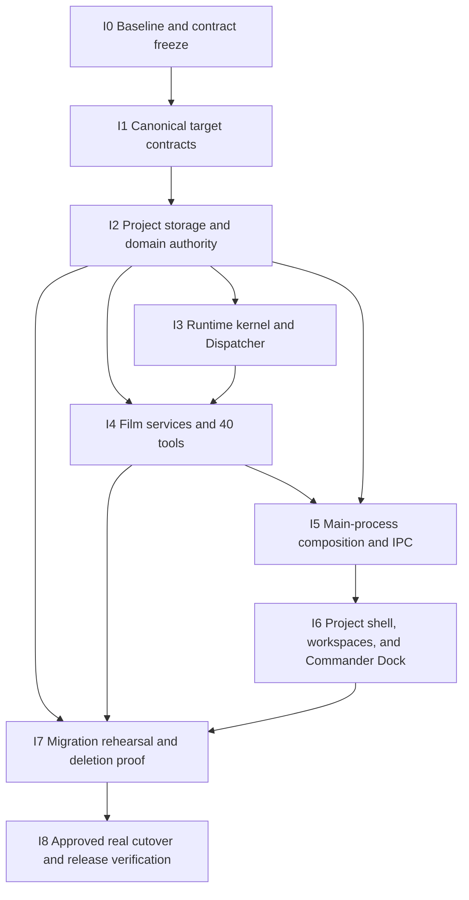

# Ground-up AI Video Production Harness Implementation Dependency Program

## Status

Planning only. This document defines implementation dependencies and verification gates. It does not
authorize source changes, schema migration, deletion, real-database access, provider spending,
packaging, or release.

The target is defined by:

- [`2026-08-15-project-first-lucid-fin.md`](./2026-08-15-project-first-lucid-fin.md)
- [`../design/project-shell-screen-contract.md`](../design/project-shell-screen-contract.md)
- [`../design/project-workspaces-contract.md`](../design/project-workspaces-contract.md)
- [`Archived data/history cutover`](../archive/target-transition/2026-08-15-project-data-history-memory-cutover.md)
- [`2026-08-15-commander-runtime-tool-surface.md`](./2026-08-15-commander-runtime-tool-surface.md)
- [`2026-08-15-film-tool-catalog-contract.md`](./2026-08-15-film-tool-catalog-contract.md)

Those contracts are authoritative. An implementation contract may refine code structure and test
fixtures, but it may not change product authority, add a Legacy Resource, hide a capability, create a
second runtime, or restore a host-authored film workflow.

## External Harness evidence

The architecture review also pins DeepSeek Harness commit
`47f943859bef60e4160492346772ded9b24f765a` as an external reference. The reviewed primary sources are
its `core`, `session`, `tools`, `compaction`, and `subagent` subsystem contracts. The source is not a
runtime dependency and no local clone was available during I0.

Lucid Fin adopts these verified invariants:

- append each model-visible fact before deriving the next model request;
- derive model history from an immutable event surface instead of mutating a second message history;
- let request hooks change typed request configuration, never secretly rewrite model-visible messages;
- execute every tool through one schema-validated, monotonic guard pipeline with immutable canonical
  results;
- record compaction as a bracketed transaction that adds a derived view while preserving source
  events and making an interrupted compaction detectable;
- give each child Run one durable descriptor, ordered inbox, activation epoch, cancellation boundary,
  and cold-resume path.

Lucid Fin does not copy DeepSeek's arbitrary shell/JavaScript execution, universal plugin host, or
private-transcript forking. Film work remains behind the exact typed catalog, Project authority,
Dispatcher, media/CAS boundaries, resource accounting, and user-visible Run controls defined here.

This program builds a new target-only AI video production Harness composition root. No target module
may import the old Canvas-as-project, Resource, Prompt, Preset, Template, Guide Injection, Commander,
or workflow path. Existing code is eligible only for contract-tested transplantation of an internal
mechanism into a target-owned module; the old interface and dependency direction are deleted.

## Outcome

The completed application is a Project-first, Codex/Claude Code-style AI video production Harness:

- Project is the top-level authority and workspace.
- Overview, Canvas, Media, Production, and Delivery render the same authoritative objects.
- Commander lives in the dock and can do real work through one frozen 40-tool catalog and one
  Dispatcher.
- Chat Messages, Project facts, user choices, results, history, memory, resources, TaskList, child
  Runs, and provider attempts have explicit owners.
- References are inspected as hash-bound media evidence before generation.
- Every valid creative result is shown; the user chooses the creative winner.
- Restart, unknown provider state, CAS conflict, cancellation, protection, and budget boundaries are
  real product paths, not error-message afterthoughts.
- Prompt, Preset, Template, Process Prompt, Guide Injection, Tool Injection, fixed production phases,
  and floating Commander do not exist in the target product.
- The target Build starts from a fresh canonical store and target-only composition root without an old
  schema, handler, route, tool registration, or fallback reader present.

## Non-negotiable implementation rules

1. Build one target architecture. Do not wrap the current Canvas/resource architecture in adapters
   and call it Project-first.
2. Do not ship dual write, long-lived compatibility flags, legacy aliases, fallback schemas, or two
   Commander execution paths.
3. A temporary old/new coexistence is allowed only inside an unshipped implementation branch while
   replacement code is unreachable. It ends at the cutover contract and never becomes a product mode.
4. Target types and authority contracts land before repositories; repositories before tools; data and
   Runtime before UI wiring.
5. Every side effect uses the single Dispatcher or the same trusted domain command service for direct
   UI actions.
6. Every stage must leave its affected packages buildable and its boundary tests green. A stage that
   makes the desktop app unable to start does not merge.
7. Real user data is not opened or changed until the separately approved cutover stage.
8. No broad cleanup, formatting pass, or unrelated refactor is bundled with a stage.

## Dependency graph

Project/data authority is completed before Runtime work begins. The only parallel work allowed before
I4 is disposable fixture/report work that does not edit contracts, schema, repositories, Runtime, or
composition roots. I4 has one integration owner. I6 does not begin against provisional APIs. I7
removes the old product only after the new product passes its end-to-end gates on disposable data.

## Integration discipline

- One integration branch/worktree owns the ordered program. Parallel workers receive disjoint files
  and one frozen contract revision; no two workers edit shared contracts, schema, registration, or
  composition roots concurrently.
- Each stage publishes its exact public types, migration version, IPC surface, generated-code state,
  tests, and validation command before a dependent stage starts.
- Contract tests assert authority and event ownership; they do not assert incidental component or
  package layout.
- Generated schemas, preload bindings, and IPC declarations are regenerated once from their canonical
  source and checked for drift. Handwritten mirrors are deleted.
- A failed stage is repaired at its owner boundary. Dependents do not add fallbacks or mock success to
  route around it.
- Existing unrelated worktree changes are preserved. Stage scope is enumerated before edits and
  reviewed before merge/commit. Commit, push, and release still require explicit user authorization.

## I0 — Baseline and contract freeze

### Scope

- Record the seven approved planning contracts and their content hashes.
- Record the pinned external Harness revision and reviewed source URLs, plus whether a local checkout
  was actually available; never claim source-level parity without that evidence.
- Inventory current schema, repositories, IPC, preload, renderer routes, tool registrations, prompt /
  preset / template / guide surfaces, TaskList workflow paths, media bytes, and provider attempts.
- Define disposable fixtures for an empty install, representative legacy Project/Canvas data, missing
  media, provider-unknown attempts, protected choices, and corrupted/unsupported drift.
- Record current build/test/startup commands and pre-existing failures without changing behavior.

### Deliverables

- Stage scope map from every current durable object and user-visible surface to target authority,
  offline export, or deletion.
- Frozen target-contract manifest.
- Repeatable fixture creator and read-only baseline report.

### Acceptance and validation

- Every current persistent table/column and model-callable tool has exactly one disposition.
- Every media byte source has a count, byte total, and content-hash strategy.
- Baseline failures are reproducible and distinguished from implementation regressions.
- No source, schema, user DB, provider, or product behavior changes.

### Stop conditions

- An unclassified durable record, ambiguous media identity, or unknown provider submission is found.
- The inventory would require opening or writing the real user DB without separate approval.

## I1 — Canonical target contracts

### Scope

- Define pure target types for Project, MediaBlob, GlobalMediaFolder, GlobalMediaAsset, ProjectMediaRef, Production,
  Canvas, Chat/Message, Run/ContextManifest, CapabilityCatalogSnapshot, TaskList, GeneratedResult,
  UserChoice, Delivery, ProjectEvent/Memory, domain attempts, and OperationRef.
- Distinguish current Project truth, immutable Chat Messages, one accepted Run objective, and optional
  Commander-owned TaskList progress; none may impersonate another authority.
- Define strict `RunInboxMessage`, `RunActivation`, turn/step boundary, event causation/correlation /
  idempotency, and compaction-transaction contracts.
- Define strict parsers for the same types and the exact 40 ToolDefinitions.
- Freeze Run/attempt state machines, actor/causation, resource amounts, typed blockers, public event
  union, private recovery envelope, and domain command/result unions.
- Define one versioned IPC contract from target use cases; do not expose database rows or service
  internals.

### Deliverables

- Canonical contracts and strict runtime parsers with no unknown-field escape hatch.
- Generated schema/catalog hashes and target public wire versioning rules; no legacy fallback parser.
- Target canonical SQL DDL as a contract artifact, not yet applied to user data.

### Acceptance and validation

- Types, parsers, DDL, ToolDefinitions, and public event schemas agree on names, ownership, and states.
- Input/output round trips are canonical; malformed, non-finite, secret-bearing, and unknown fields fail.
- ProjectMediaRef, Delivery objects, actor semantics, protections, and OperationRef have one spelling and
  one owner across all packages.
- Contracts/parse builds and focused contract tests pass; no desktop/runtime wiring changes yet.

### Stop conditions

- A target field has two owners, a tool needs a generic patch/blob, or an IPC method bypasses a domain
  command.

## I2 — Project storage and domain authority

### Scope

- Implement canonical target schema and repositories against disposable new databases.
- Implement Project, Media, Production, Canvas, Chat, History, Memory, Result/Choice, Delivery, Run,
  TaskList, and attempt transactions.
- Persist the Run inbox, activation epochs, turn/step boundaries, catalog snapshot, and bracketed
  compaction events in the same append-only Run event authority; do not persist a second mutable model
  message history.
- Enforce expected revision, idempotency, ProjectEvent atomicity, actor/causation, immutable evidence,
  media CAS, protected-state reads, and authority re-read APIs.
- Implement the one-way migration transformer against copied/fixture databases, but do not run it on
  the real database.

### Deliverables

- One repository/command boundary per authority and no renderer-facing SQL.
- Deterministic target DDL validator and one-way migration report.
- Hash/count/provenance preservation checks and offline export format for unbound old
  Prompt/Style/Preset/Template data.

### Acceptance and validation

- Fresh DB and migrated fixture DB both equal canonical DDL with integrity/FK checks clean.
- Domain change + UserChoice where relevant + ProjectEvent commit atomically or not at all.
- Media bytes and hashes are preserved; derived media creates new immutable Blob/Asset records.
- Chat deletion never depends on TaskList and never deletes committed Project facts/results.
- Reopen is deterministic; extra unknown drift fails before writes; failure rolls the whole migration
  back.
- Replaying the same event prefix derives the same inbox, activation, model view, and compaction state;
  duplicate commands and an interrupted compaction cannot rewrite prior facts.
- Storage/domain builds and transaction/migration tests pass on disposable paths only.

### Stop conditions

- Any row cannot be mapped without guessing, bytes/hash differ, a provider attempt has ambiguous
  submission identity, or canonical migration would discard user-visible evidence.

## I3 — Runtime kernel and Dispatcher

### Scope

- Reduce the system prompt to identity, truth, scope, authority, discovery, communication, and locale.
- Implement the target Run Coordinator, Context Builder, Model Adapter protocol, and one Agent Loop as
  the only Harness runtime chain.
- Implement one content-addressed frozen Capability/Skill Catalog Snapshot per Run.
- Implement one Agent Loop and one Dispatcher pipeline for validation, scope, permission,
  protection/confirmation, cost, CAS, prepared attempts, execution, output validation, settlement,
  public projection, encrypted recovery, and persist-before-broadcast.
- Implement event-derived context, compaction as a pure model view, exact cold recovery, cancellation,
  resource accounting, and provider-unknown reconciliation.
- Derive every model request only from the durable accepted event surface plus current authoritative
  Project reads. Request hooks may alter typed provider configuration but cannot mutate or inject
  uncited model-visible messages.
- Keep TaskList, Skills, Subagents, and Tool Program optional peers; remove fixed phases and behavior
  injections from the target path.
- Implement one active root activation per Chat, safe-boundary follow-up delivery/queueing, concurrent
  background Runs across Chats/Projects, child scheduling, pause/stop, and parent-before-child recovery.

### Deliverables

- Runtime usable through fake target-domain tools without UI or real providers.
- Stable catalog and exact recovery fixtures.
- Public timeline free of reasoning, raw tool payloads, paths, credentials, and provider bodies.

### Acceptance and validation

- Productive work is not stopped by a product step cap or host creative heuristic.
- Sending to an active Chat produces a durable `delivered|queued|waiting` state rather than an
  active-session error; other Chats continue in the background subject to resource/CAS boundaries.
- Every call uses the frozen catalog and same Dispatcher; no direct service bypass exists.
- TaskList state never changes tool visibility, and the accepted catalog cannot gain or lose a tool
  during the Run.
- Compaction emits durable start/derived-view/end evidence; a crash between boundaries is detected and
  leaves the original event history authoritative.
- Protected confirmation binds immutable input/revision/manifest/quote and is revalidated after answer.
- Restart produces no duplicate Message, tool effect, reservation, or provider submission.
- Unknown usage/cost remains unknown; capped unknown-cost work blocks before spending.
- Agent/application/runtime builds and focused loop/Dispatcher/recovery/privacy tests pass.

### Stop conditions

- A second event bus/executor/context owner appears, recovery requires private reasoning, or any tool
  needs live-registry visibility changes during a Run.

## I4 — Film services, exact tools, and reviewed Skills

### Scope

- Implement the exact 40 tools from the frozen catalog against I2 domain commands and I3 Dispatcher.
- Implement hash-bound media inspection, typed derivation, strict provider extensions, generation,
  assessment, choice/protection, Review Cut/export operations, Run inspection, TaskList, child Runs,
  and bounded Tool Program.
- Version and hash the Tool Program AST and enforce explicit call, concurrency, output, runtime, and
  resource limits. Give Subagents durable send/wait/result/cancel, one ordered inbox, activation epochs,
  and restart-safe cold resume through the same Run Coordinator.
- Convert only reviewed reusable film expertise from old prompts/guides into immutable Skills. Do not
  bulk-import old resources or preserve injection behavior.
- Preserve all 287 prior reusable source records as manifest-bound Skill envelopes—216 presets, 19
  shot templates, 26 renderer Skills, 21 process prompts, and 5 prompt templates. Only reviewed,
  trusted versions are runtime-eligible; unreviewed content remains quarantined.
- Implement configured provider adapters behind typed capability/quote/attempt contracts.

### Deliverables

- Exactly 40 registered IDs with complete input/output schemas and catalog hashes.
- No model-callable legacy tool, alias, prompt/preset/template manager, credential mutation, raw file,
  shell, database, or arbitrary network tool.
- Built-in Skill pack with provenance, trust, versions, and no authority expansion.

### Acceptance and validation

- Catalog inventory equals definitions equals registration; every result validates, clones, freezes,
  projects safely, and recovers by declared profile.
- `media.inspect` lets the model see accepted image/video/audio/document evidence without paths.
- Every long operation returns OperationRef and is observed/cancelled through its real owner.
- Every valid generated result persists and is shown; evaluation never silently selects a winner.
- Child Runs narrow scope/resources, expose public progress, accept follow-up, and can be stopped.
- Tool/adapter/package builds and per-family contract tests pass with fake/local providers only unless
  a separately approved paid-provider test is granted.

### Stop conditions

- A tool requires generic CanonicalJson, provider-specific untyped options, direct repository access,
  hidden phase policy, or an owner absent from I2.

## I5 — Main-process composition and IPC

### Scope

- Create the target-only desktop composition root and compose target repositories, domain commands,
  Run Coordinator, Context Builder, Model Adapters, Agent Loop, Dispatcher, provider adapters, media
  services, and one IPC router.
- Generate preload and renderer types from the canonical IPC source.
- Implement startup schema validation, recovery barrier, operation reconciliation, graceful shutdown,
  and structured localized error codes.
- Provision the manifest-bound built-in Skill pack through the host initializer before startup reports
  ready; repeated and cold-restart provisioning must be exact and idempotent.
- Implement cursor-based public event hydration/reconnect and typed Run inbox/control IPC. Persist the
  accepted command/event before broadcasting it; reconnect never depends on a renderer-only cache.
- Add startup/handler coverage before any renderer switches to the new surface.

### Deliverables

- One startup path that either becomes fully ready or fails visibly before renderer actions enable.
- One handler per target use case, generated preload, and no handwritten shadow bridge.
- A dependency scan proving the target composition root imports no old Canvas-as-project, Resource,
  Prompt/Preset/Template/Guide, Commander Runtime, or workflow module.

### Acceptance and validation

- Fresh and migrated disposable DB startup registers all target handlers.
- Fresh and migrated disposable DB startup contains the complete canonical built-in Skill pack;
  unreviewed built-ins remain quarantined and startup never auto-enables a Skill for a Project.
- Target startup succeeds when the old schema/modules are absent from the test/package environment.
- Create/open Project, create Chat, attach accepted media, start/stop/recover Commander, inspect
  OperationRef, and query all five workspaces succeed through IPC tests.
- A failed schema/recovery barrier cannot leave a half-enabled renderer or unregistered-handler storm.
- Desktop-main build, code generation drift check, startup/router tests, and secret sentinel pass.

### Stop conditions

- Any renderer feature needs direct Electron/SQL/service access or startup can report ready before all
  required handlers are registered.

## I6 — Project shell, five workspaces, and Commander Dock

### Scope

- Replace the current shell with Project Home and the Project route described by the screen contract.
- Implement Overview, Canvas, Media, Production, and Delivery over target IPC and shared selection.
- Implement Chats as a Project section and Commander as a dock, never a floating modal/panel.
- Render one inline Assistant execution surface: public progress, optional TaskList, optional child
  Runs, questions/confirmations, results, execution disclosure, and final summary.
- Show the accepted Run objective, queued/follow-up Messages, current activation, and optional child /
  Tool Program work inline; pause, resume, send, stop, and inspect use that one surface, not an activity
  modal.
- Remove end-user prompt/preset/template/tool-injection management surfaces from the target UI.

### Deliverables

- Responsive target shell, route restoration, shared selection, workspace deep links, empty/error /
  loading/recovery states, and EN/ZH copy.
- User-manageable high-level permissions, budgets, providers, Skills, plugins, Run controls, choices,
  protections, and history—never raw tools or private reasoning.

### Acceptance and validation

- The screen contract's minimum viewport and every workspace contract pass component/Electron smoke.
- The user can move from Chat result to Media comparison, select/refine, inspect Production/Canvas,
  make a Review Cut, and export without duplicate state or modal activity console.
- TaskList exists only as Commander progress and never blocks Chat/Project lifecycle.
- All buttons are backed by a registered target IPC/domain command or are visibly disabled with a
  typed reason; no click silently reloads a panel.
- Renderer build, focused interaction/accessibility/i18n tests, detector review, and desktop smoke pass.

### Stop conditions

- UI requires copying domain state into a workspace-specific store, opening a second Commander view,
  or wiring against provisional/legacy IPC.

## I7 — Migration rehearsal and legacy deletion proof

### Scope

- Run the one-way migration repeatedly on copied representative databases and media directories.
- Generate and verify complete pre/post reports, offline export, backup/restore instructions, and
  failure rollback.
- Preserve Legacy Run/Task/workflow records only as a non-schedulable imported-history ledger; prove
  target inbox, activation, compaction, catalog, and child lineage with a separate target-native Run.
- Build an independent target-only release-candidate entry and enumerate every old schema/API/tool/UI /
  prompt/preset/template/guide/phase path in a deletion manifest. Physical deletion and the official
  Electron entry switch remain separate approval-gated actions.
- Prove no target production import, route, IPC, registry, or schema depends on deleted code.
- Extend disposable replay fixtures with Run inbox ordering, activation epochs, compaction
  start/derived/end evidence, catalog digest, and parent/child lineage.

### Deliverables

- Migration executable with dry-run/report mode and exact supported-source fingerprint.
- Deletion manifest and zero-reference audit.
- Reproducible target-only release-candidate build graph and file manifest; no installation or release.

### Acceptance and validation

- Copy migration preserves IDs, Messages, user choices, media bytes/hashes, valid results, attempts,
  Delivery order, History causation, and supported settings.
- Unbound old creative resources are exported once and absent from target DB/UI/runtime.
- Additional drift, invalid FK, hash mismatch, or ambiguous ownership refuses before destructive
  changes and leaves the copy unchanged.
- Fresh install and migrated copy pass the same full target test suite and startup smoke.
- The target-only release-candidate transitive closure contains no callable/discoverable Legacy
  Resource or compatibility alias. Repository-wide zero Legacy is claimed only after an approved
  physical deletion.

### Stop conditions

- Any legacy data needs guessing, any target feature still imports old code, rollback is not proven, or
  the application only works through a dual-write/feature-flag mode.

## I8 — Approved real cutover and release verification

### Scope

- Execute only the already verified I7 copy/transform bundle from the exact approved read-only real
  source into a fresh canonical target store.
- Replace the live application/store pointer once and verify the target release. The target store is
  created without Legacy objects; cutover never deletes or rewrites the source store.
- Retain recovery copies offline until separately approved for physical disposal.
- Verify in the installed target Build that Project/Chat/Run relationships, queued messages, child work,
  choices, media evidence, budgets, history, and recovery are visible and user-manageable without any
  external DeepSeek runtime.

### Deliverables

- Verified backup/export, migrated target store, signed reconciliation/startup report, and exact
  Build/DDL/catalog/migration hashes.
- Target-only installed release plus rollback/forward-repair record.

### Required approvals

This stage uses three separate approvals; no blanket approval can replace them.

#### Approval A — maintenance and final copy

Request approval to close the running app, reject new writes, create a complete named backup/offline
export, snapshot the exact database/media root identified by read-only preflight, build the final
target store, and produce reconciliation. Preflight must show zero accepted, running, paused, or
waiting legacy Runs and zero nonterminal TaskLists. This approval does not switch the app or delete
anything.

#### Approval B — atomic cutover

Show the source fingerprint; new Build/DDL/catalog/migration hashes; zero-blocker reconciliation;
expected downtime; the exact old Runtime/UI/tool/data entrypoints being disabled; backup location; and
the fact that automatic rollback is safe only before the first ordinary target write. Then request
approval to switch the Build/store, verify target startup, and open target writes.

#### Approval C — later physical disposal

After an agreed retention period, separately list the exact old database, old media/CAS files, offline
Legacy export, and backup proposed for deletion, then request approval. The target application never
reads those archives while retained. Product cutover does not imply permission to purge recovery
copies.

Additional explicit approval remains required for:

- Any paid provider calls used for final validation.
- Packaging/installing/replacing the current application build if it is not already included in the
  exact atomic-cutover request.

Approval of this planning document is not approval for those actions.

### Execution

- Verify source fingerprint, free space, backup destination, media hashes, DB integrity/FKs, and no
  running writer; re-check zero accepted/running/paused/waiting legacy Runs and zero nonterminal
  TaskLists immediately before snapshot.
- Create backup/export and verify they can be opened. Build a new canonical target store from the
  stable read-only snapshot; never update or delete the source store.
- Start the target Build against that target store in maintenance/read-only verification mode, run
  bounded smoke, and compare the pre/post report. Approval B then switches the application/store
  pointer and opens target writes; retained old material remains offline under Approval C.
- On any failure before target writes open, stop, preserve logs/report, discard the incomplete target
  copy, and keep or restore the old Build/store pointer. Do not mutate the source, restore over it, or
  continue through a hidden fallback.
- After the first ordinary write to the target store, do not automatically downgrade to the old app;
  repair forward or perform a separately reviewed restore to avoid losing new target-only evidence.

### Release gate

The release is complete only when all end-to-end gates below pass on fresh and migrated installs and
the user can see/manage the resulting Project state, choices, child work, resources, and history.

### Acceptance and validation

- Approval A/B boundaries, source fingerprint, backup verification, zero-blocker reconciliation, and
  maintenance state are recorded before switching, including zero active legacy Runs and zero
  nonterminal TaskLists.
- Target startup, Project/Chat read, local media inspection, reversible mutation, Run start/stop,
  choice projection, restart, and Delivery manifest smoke pass before ordinary use.
- The final report proves that the live target store/runtime contains no callable Legacy Resource and
  that retained old material is offline only.
- Every end-to-end release gate below passes on the migrated install; the same release already passed
  on a fresh install in I7.

### Stop conditions

- Source fingerprint changes; a writer, accepted/running/paused/waiting legacy Run, or nonterminal
  TaskList remains; backup verification fails; reconciliation is non-zero; target startup/smoke fails;
  the user withdraws approval; or any step needs a Legacy fallback. Stop without opening target
  writes.
- After target writes open, any restore/downgrade requires a new evidence-based recovery plan and
  explicit approval; never silently discard target-only events.

## End-to-end release gates

| Gate                       | Required user outcome                                                                                                                    |
| -------------------------- | ---------------------------------------------------------------------------------------------------------------------------------------- |
| Project start              | Create/open Project, see Overview, create Chat, and navigate all five workspaces                                                         |
| Reference fidelity         | Attach an image/video/audio/document, Commander inspects hash-bound evidence, and generated work cites exact references                  |
| Simple work                | Ask for a fact or small reversible change without forced plan/TaskList/Subagent                                                          |
| Complex work               | Commander may create/update its TaskList and the user sees current work inline                                                           |
| Generation                 | Exact prompt/reference/provider/seed/revision is submitted and every valid result appears                                                |
| Creative choice            | User Select/Reject/Refine/Use-as-reference is identical in Chat, Media, Production, and History                                          |
| Protected fact             | Commander proposes a change, exact confirmation names the protected scope, and actor/causation remain correct                            |
| Child work                 | Commander may delegate; user can inspect, redirect, pause/stop, and see retained child results/resources                                 |
| Long operation             | Generation/derive/evaluate/preview/export exposes progress, cancel when supported, usage, and unknown state without duplicate submission |
| Conflict                   | Concurrent edit yields typed CAS conflict and preserves the user's newer state                                                           |
| Restart                    | Active Run and operations recover without duplicate Message, tool effect, cost, or provider submission                                   |
| Active Chat follow-up      | A second Message is durably delivered at a safe boundary or visibly queued; it never fails because a root Run is active                  |
| Background concurrency     | Runs in other Chats/Projects continue with independent transcript/context and CAS/resource-protected shared authority                    |
| Delivery                   | User reviews sequence/Review Cut, freezes exact manifest, confirms export, and receives receipt/artifact                                 |
| Lifecycle                  | Chat archive/delete never depends on TaskList and never deletes committed Project facts/results                                          |
| Privacy                    | No private reasoning, credential, path, raw provider payload, or secret sentinel reaches UI/history/search/log/export                    |
| Localization/accessibility | EN/ZH and keyboard/focus/contrast behavior cover success, empty, waiting, blocked, failed, and recovery states                           |

## Program completion criteria

The implementation program is complete only when:

1. The target release passes every gate on fresh and migrated installations.
2. The canonical target DDL, 40-tool catalog, IPC, preload, Runtime catalog, and UI agree with no drift.
3. No Legacy Resource, floating Commander, fixed film workflow, behavior injection, direct tool bypass,
   duplicate owner, compatibility alias, or dual-write path remains.
4. All real-data changes were separately approved, backed up, reported, and verified.
5. No required work remains hidden behind TODOs, disabled tests, placeholders, or silent fallbacks.
